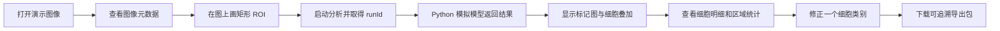
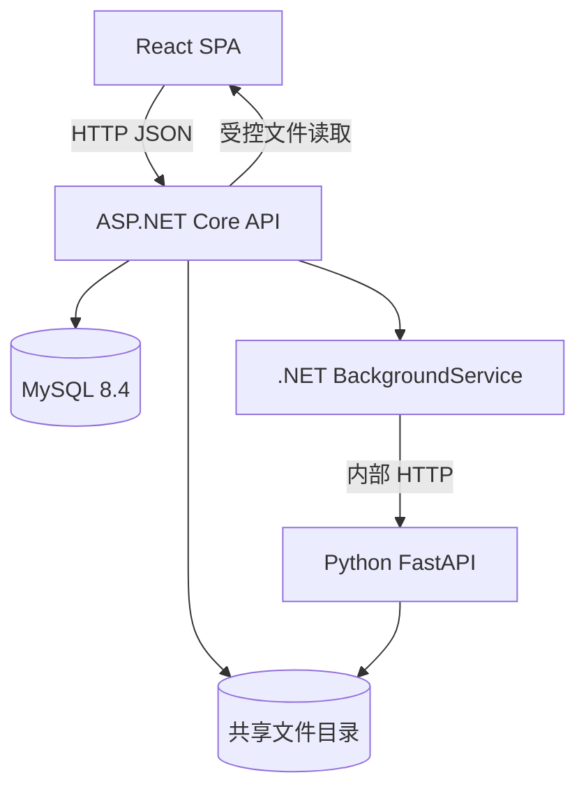
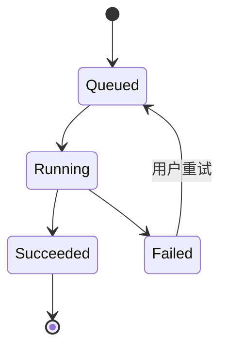

# 多靶点标记肿瘤组织细胞定量分析平台 本地复现 SPEC

**文档状态：**首版工程原型已实现并通过本地验收（2026-09-28），详见 `docs/VERIFICATION.md`。
**目标：**在独立的新项目中实现一个本地可运行的前后端分离原型，完整演示“图像导入 → 圈选区域 → 调用 Python 模拟模型 → 查看细胞 → 统计 → 复核 → 导出”。  
**与现有项目关系：**本项目独立于 ClinicFlow，不复用或改动 ClinicFlow 代码与数据库。  
**技术主线：**React + TypeScript + Vite 前端、.NET 10 / ASP.NET Core 后端、独立 Python FastAPI 模拟算法服务、MySQL 8.4、受控本地文件目录。选 .NET 10 是因其当前为受支持的 LTS 版本；具体依赖版本在项目文件和锁文件中固定。[N2]  
**使用边界：**科研/教学演示。模拟数据和模拟模型结果不得标为真实医学结果。

## 项目名称与原型边界

本 SPEC 能复现的是**“多标记组织图像单细胞定量分析平台的工程原型”**：同一区域至少测量 panCK 和 CD8 两个标记，结果落到每一个核对象，并能按 ROI 汇总。多重染色的报告标准把“同一组织切片至少两个目标标记”作为多重分析的基本条件。[S1]

它目前**不能证明真实肿瘤细胞识别或医学测量性能**，因为首版使用合成数据和模拟模型，而且核检测不等于精确全细胞分割。因此演示界面和汇报中须使用“候选肿瘤相关细胞”“模拟结果”“工程原型”等措辞。要升级成真实科研平台，必须接入有染色说明的真实组织数据、适配真实模型，并用人工参考标注验证细胞、标记和区域结果；这些属于第二阶段验收，不得拿本地演示通过替代。SITC 的图像分析建议也把组织/细胞分割、表型与算法验证分开报告。[S2]

> 实施变更（2026-09-28）：按用户要求，数据库改为 MySQL 8.4，采用官方 MySql.EntityFrameworkCore 10 提供程序；其余功能与验收标准保持不变。项目直接位于 OncoMosaic 仓库根目录。

## 1 开发目标与完成定义

开发完成后，人在新电脑上按 README 运行 `docker compose up --build`，打开本地网页，能选择随项目提供的演示图像，并从头到尾走完一次分析。页面刷新后图像、ROI、任务、细胞、复核和报告仍在。停止后重新启动容器，数据库与文件结果仍在。用户也能上传另一份符合演示格式的文件并重复流程。

**完成不等于只有静态页面。** 点击“开始分析”必须由 .NET 创建持久任务，实际发起到 Python 服务的 HTTP 调用，接收结果并入库；Python 服务可以模拟算法，但不能由前端直接写死一组细胞点代替调用。重试、失败提示、导出与复核需真实工作。

### 首版必须实现

- 单用户本地使用，无登录。项目和图像列表、图像详情。
- 支持一个明确的演示高光谱格式：`.npz`，见第 4 节；提供可重复生成的样例。
- 图像预览、平移缩放、通道开关、矩形 ROI。多边形 ROI 可列为扩展，不作为首版门槛。
- 分析任务的排队、运行、完成、失败、重试及刷新后状态恢复。
- .NET 到独立 Python 服务的真实 HTTP 调用；Python 返回与 ROI 对齐的模拟标记图和细胞测量；阳性阈值与区域统计由 .NET 根据原始测量值计算。
- 细胞点/轮廓叠加、单细胞详情、阳性规则与四个区域指标。
- 逐细胞人工类别修正，保留自动结果与复核版本。
- CSV、PNG 叠加图和 JSON 方法记录导出。
- API、Python、前端和整链路的必要测试及本地运行手册。

### 首版不做

DICOM/DICOMweb、真实高光谱模型训练或推理、真实临床数据、整张切片金字塔瓦片、多用户权限、病理诊断、疗效预测、复杂细胞谱系分类、任意扫描仪文件格式。真实 ENVI/OME-TIFF 文件读取可作为第二阶段适配器；首版 `.npz` 是为了确保本地复现链路可验证，不把它描述成行业交换标准。

## 2 QuPath 参考范围

QuPath 的多重图像教程采用“项目管理 → 核检测与通道测量 → 每个标记分类 → 组合分类 → 查看/导出”的流程；其查看器支持平移、缩放、标注、分类叠加和测量表。[Q1][Q2] 本项目借鉴**功能组织和交互模式**：左侧项目/图像列表，中央主图，右侧通道、对象、测量详情，顶部工具栏，底部任务状态。QuPath 的 JavaFX 代码可用于理解对象、ROI、测量与查看器的职责，但本项目应自主实现 React/.NET 代码，不直接移植它的类或复制资源。QuPath 官方说明其代码采用 GPLv3 或更新版本；若未来要直接复制或链接代码，需单独处理许可证义务。[Q3]

可供下一 session 查阅的具体参考：

- [QuPath 多重分析教程](https://qupath.readthedocs.io/en/latest/docs/tutorials/multiplex_analysis.html)：工作流和结果呈现。
- [QuPath 查看器说明](https://qupath.readthedocs.io/en/latest/docs/starting/viewing.html)、[标注说明](https://qupath.readthedocs.io/en/latest/docs/starting/annotating.html)：交互参照。
- [QuPathViewer.java](https://github.com/qupath/qupath/blob/main/qupath-gui-fx/src/main/java/qupath/lib/gui/viewer/QuPathViewer.java)：查看器职责和叠加选项参照。
- [QuPath 对象层级概念](https://github.com/qupath/qupath/wiki/Object-hierarchies)：图像、标注和检测对象之间的关系参照；本项目只需简化为 Image → Roi → AnalysisRun → Cell。

## 3 页面设计与用户旅程

### 页面结构

```text
┌──────────────────────────────────────────────────────────────────────────────┐
│ 项目名 / 图像名          [平移] [矩形ROI] [显示细胞] [开始分析] [导出]       │
├────────────────┬────────────────────────────────────────────┬────────────────┤
│ 项目/图像列表  │                                            │ 通道           │
│ + 导入图像     │              中央图像查看器                │ □ 合成图       │
│ 图像 A         │   缩放、平移、矩形ROI、细胞叠加与点击       │ □ DAPI         │
│ 图像 B         │                                            │ □ panCK        │
│                │                                            │ □ CD8          │
│                │                                            ├────────────────┤
│                │                                            │ 选中细胞详情   │
│                │                                            │ 强度/类别/修正 │
├────────────────┴────────────────────────────────────────────┴────────────────┤
│ 任务状态：排队/运行/完成/失败  |  统计：总数、候选细胞、密度、距离       │
└──────────────────────────────────────────────────────────────────────────────┘
```

布局可以调整，但交互能力必须保留。画面应让用户一直看着原图和叠加结果；不要把每一步拆成互不关联的表单页面。桌面宽度优先，移动端只要求能读列表和结果，不要求完成 ROI 精细绘制。使用自有图标和样式，不复制 QuPath 的图标、截图或视觉素材。

### 端到端旅程



## 4 演示输入与模拟算法契约

### 演示文件

首版上传一个 `.npz` 文件（NumPy 压缩数组），内部字段固定：

| 字段 | 类型与约束 | 含义 |
|---|---|---|
| `cube` | `float32[H,W,B]`，首版 `H,W ≤ 2048`、`3 ≤ B ≤ 64`、所有值有限 | 高光谱数据立方体 |
| `wavelengths_nm` | `float32[B]`，严格递增 | 波段中心波长 |
| `pixel_size_um` | 正数标量 | 每像素的物理边长 |

提供 `scripts/generate_demo_hsi.py`，固定随机种子生成一份建议为 `256×256×16` 的合成夹具 `sample-hsi.npz`，并将这份小型夹具随仓库提供。生成器应在多波段里放入明显的核状斑点与两类标记图案，使模拟结果与预览图在位置上对应。首次启动时由后端幂等创建演示项目并导入这份夹具；重复启动不能新增重复图像。数据没有患者来源，页面上固定显示“合成演示数据 / 模拟模型”。前端上传文件上限先设为 50 MB；Python 读取前校验解压后预期数组形状和字节数，解压后的 `cube` 不得超过 256 MB，拒绝超规格数据。

`.npz` 是本地复现格式。将来接真实数据时新增输入适配器，不改变 Image、ROI、任务和结果对象。

### Python 服务接口

Python FastAPI 暴露内部接口，不直接供浏览器访问。API 文档可由 FastAPI 自动生成，但请求/响应类型必须显式定义。[P1]

| 接口 | 请求 | 响应 | 行为 |
|---|---|---|---|
| `GET /v1/health` | 无 | 服务和 `mock-unmix-v1` 状态 | Compose 健康检查 |
| `POST /v1/inspect` | 文件引用 `imageKey` | `H,W,B`、波长、像素尺寸、预览图文件引用 | 读取并校验上传图像 |
| `POST /v1/analyze` | `runId`、`imageKey`、矩形 ROI、模型版本 | 结果清单，含标记图、核掩膜、细胞明细文件引用 | 实际执行模拟推理与测量；相同 `runId` 重试须返回相同结果 |

**模拟模型的确定性规则：**从 16 个波段使用固定权重生成 `DAPI`、`panCK`、`CD8` 三张 0–1 范围的标记强度图；再对 DAPI 图进行阈值和连通区域核检测，过滤面积明显异常的对象；为每个核记录原图坐标与 DAPI 核内平均强度；panCK、CD8 在该核周围的受限测量区域求平均值，并排除相邻核像素。该区域是演示用近似测量，不等同精确细胞边界。固定输入、ROI、参数与版本应给出相同结果。该规则只是 `mock-unmix-v1` 的演示实现，不能叫“训练好的医学模型”或报告准确率。Python 可以使用 NumPy、scikit-image 和 Pillow；区域测量可参考 scikit-image `regionprops` 的官方定义。[P2]

**输出文件：**`markers/` 下的每标记 PNG 供网页显示，`nuclei-mask.npy` 保存完整整数实例编号，`nuclei-overlay.png` 供网页叠加，`cells.json` 提供每个细胞的局部编号、原图坐标、核轮廓/中心、强度与质量标志。展示 PNG 的亮度拉伸和用于统计的原始 0–1 强度必须区分；统计不得反读已经压缩为 8 位显示图的数值。

**返回清单示意：**

```json
{
  "runId": "<uuid>",
  "modelVersion": "mock-unmix-v1",
  "roi": { "x": 20, "y": 30, "width": 180, "height": 160 },
  "markers": [
    { "name": "DAPI", "displayKey": ".../dapi.png" },
    { "name": "panCK", "displayKey": ".../panck.png" },
    { "name": "CD8", "displayKey": ".../cd8.png" }
  ],
  "maskKey": ".../nuclei-mask.npy",
  "overlayKey": ".../nuclei-overlay.png",
  "cellsKey": ".../cells.json",
  "cellCount": 42
}
```

`42` 仅是接口形状的示意数字，不是预测样例应产生的数量。路径是服务端受控的相对文件键，不接受客户端自传的任意绝对路径。

### 模型替换点

Python 内部定义一个小接口：`inspect(image) → ImageMetadata`，`analyze(image, roi, config) → AnalysisArtifacts`。首版实现 `MockSpectralAdapter`；以后真实模型实现同一接口，并保留输出格式和坐标约定。若真实模型只输出区域标签，不能伪造标记图，需要调整功能需求。外部模型版本、预处理、输入波长范围和输出标记名称均写入任务记录。

## 5 系统架构与推荐目录



- **.NET API** 负责外部请求、数据验证、数据库事务、分析任务、分类规则、统计、复核与导出。
- **.NET 后台任务** 从数据库领取待运行任务，调用 Python，检查返回清单并把细胞明细入库。仅一个实例运行时可用 `BackgroundService`；任务记录不只保存在内存里。Microsoft 官方文档给出这一托管后台工作模式。[N1]
- **Python 服务** 只知道文件键、ROI、模型参数和输出文件；不维护用户、项目或复核记录。
- **共享文件目录** 挂载到 API 和 Python 容器，按 `images/{imageId}`、`runs/{runId}` 分区。API 对外按授权的资源 ID 读取文件，不把容器绝对路径暴露给前端。
- **Compose 启动顺序** 以数据库和 Python 健康检查为前提，再运行 EF Core 迁移和演示数据幂等导入；数据库及文件目录使用持久卷。服务重启后不得重复导入样例或丢失任务。

建议新建独立目录 `TumorCellPlatform/`：

```text
TumorCellPlatform/
  SPEC.md                  # 本文的副本
  README.md                # 一键启动与演示步骤
  compose.yaml
  frontend/                # React + TypeScript + Vite
  backend/
    TumorCellPlatform.Api/ # Web API、BackgroundService、EF Core
    TumorCellPlatform.Tests/
  inference/
    app/                   # FastAPI、MockSpectralAdapter
    tests/
  scripts/
    generate_demo_hsi.py
  data/                    # 本地数据卷或演示夹具，不放真实病人数据
```

## 6 功能需求与验收标准

### F01 项目与图像导入

**操作：**创建项目或使用默认演示项目，上传 `.npz`。  
**输入：**文件、图像名称、可选说明。  
**处理：**API 先写临时文件并计算 SHA-256；调用 Python `inspect` 校验数组和元数据；成功后原子移动到受控目录，保存 Image 记录和预览图；失败清理临时文件并返回字段级错误。  
**输出：**图像 ID、元数据、预览图、可读错误。  
**验收：**演示文件能导入并显示 `H,W,B`、波长范围与像素尺寸；坏文件不会留下可分析图像；刷新后图像仍在。

### F02 图像查看与矩形 ROI

**操作：**在中央查看器平移、缩放；开关合成预览和结果通道；用矩形工具画 ROI，选择“肿瘤候选区域/其他区域”标签，编辑名称并保存。  
**输入：**图像 ID、矩形左上角坐标与宽高、区域标签。  
**处理：**坐标统一为原图像素坐标，左上角为 `(0,0)`；前端缩放/平移只改变显示变换，保存前转换回原图坐标；API 检查矩形在图像范围内且宽高 > 0。  
**输出：**ROI ID、面积、区域标签及叠加框。  
**验收：**任意缩放比例下画出的 ROI 在刷新后仍落在相同原图位置；越界或空 ROI 被拒绝。

### F03 分析任务

**操作：**选择 ROI 和阈值方案，点击“开始分析”。  
**输入：**`imageId`、`roiId`、`modelVersion=mock-unmix-v1`、阈值配置版本。  
**处理：**API 创建 `Queued` 任务并立即返回 `runId`；后台服务把任务置为 `Running`，调用 Python `analyze`；成功校验图像尺寸、坐标和 `cells.json` 后一次性写入细胞与结果，状态置为 `Succeeded`；失败保存原因并置为 `Failed`。任务有明确的 `attempt` 计数；同一 `runId` 的重试不能产生重复细胞。  
**输出：**任务状态、时间、失败原因或结果摘要。  
**验收：**真实 HTTP 调用可在 Python 日志中看到；关闭 Python 服务会出现可理解的失败状态，恢复后可重试；刷新网页任务状态不丢失。



### F04 标记图与细胞查看

**操作：**在右侧开关 DAPI、panCK、CD8；在图上切换“显示核轮廓/只显示中心点”，点击一个细胞。  
**输入：**成功的 `runId`、所选通道与细胞 ID。  
**处理：**API 提供受控的标记图与核掩膜地址、当前视野内的细胞坐标；前端用同一原图坐标系叠加，缩放时图像与细胞一起移动。右侧详情显示强度、自动标签与质量提示。  
**输出：**标记图、细胞叠加层、细胞详情；详情中标明 DAPI 为核内测量，panCK/CD8 为核周近似测量。  
**验收：**点击叠加点能打开正确细胞；放大后细胞点仍与核图对齐；切换通道不改变细胞位置。

### F05 阳性规则与区域统计

**操作：**选一套阈值配置，查看区域统计；规则界面至少可编辑 panCK、CD8 两个 0–1 阈值。  
**输入：**Cells 的原始强度、ROI 面积、像素尺寸和阈值。  
**处理：**由 .NET 根据保存的强度判定每细胞各标记阳性/阴性；计算：`总核数`、`panCK 阳性候选细胞数`、`某标记阳性比例 = 阳性数 / 有效细胞数`、`阳性密度 = 阳性数 / ROI 面积(mm²)`、`panCK/CD8 双标记组合计数`（只表示同一核对象附近的两个模拟信号组合，不解释为确定的生物学身份）、`CD8 阳性核中心到最近 panCK 阳性核中心的距离(µm)`。只有 ROI 被标为“肿瘤候选区域”时，界面才展示“候选肿瘤相关细胞”称谓；始终不显示“确诊肿瘤细胞”。只统计核中心在 ROI 内的对象；接触裁剪边缘的核带质量标志，允许复核排除。距离用原图坐标与像素尺寸换算；如果某类细胞为空，最近邻指标显示“无可计算对象”，不写 0。阈值变更生成新的分析/规则版本，旧统计仍可回看。  
**输出：**指标卡、简单分布图、参与统计的细胞列表与计算口径。  
**验收：**修改阈值后阳性数和比例按预期变化；缺失对象时没有除零或误导性 0；同一数据和规则重算结果一致。

### F06 人工复核

**操作：**选中细胞，把自动类别改为指定类别或“排除”，输入可选原因，提交复核。  
**输入：**`runId`、细胞 ID、修正类别、说明。  
**处理：**API 新增 `ReviewRevision` 与修正项；自动类别和原始强度保持不变；统计用“最新复核版本”覆盖显示，同时可切回“原始自动结果”。  
**输出：**复核版本号、修正前后类别和新统计。  
**验收：**修正可见、刷新后保留、原始结果可查看；同一细胞的重复修正有明确顺序；导出指定版本与页面统计一致。

### F07 导出

**操作：**在分析结果页选择“原始结果”或某个复核版本，点击导出。  
**输入：**`runId`、`reviewVersion`。  
**处理：**服务端生成 ZIP：`cells.csv`、`roi-summary.csv`、`overlay.png`、`method.json`。`method.json` 包含原图校验值、ROI 坐标、模型版本、阈值、算法版本、复核版本和生成时间。  
**输出：**可下载 ZIP。  
**验收：**CSV 的行数与细胞列表口径一致，区域统计与页面一致，`overlay.png` 与所选版本一致；旧版本导出可重复生成。

## 7 数据模型与文件约定

| 表 | 关键字段 | 说明 |
|---|---|---|
| `Projects` | `id`, `name`, `created_at` | 首版可只有一个演示项目 |
| `Images` | `id`, `project_id`, `name`, `file_key`, `sha256`, `width`, `height`, `band_count`, `wavelengths_json`, `pixel_size_um`, `preview_key` | 图像元数据；原始数组不放数据库 |
| `Rois` | `id`, `image_id`, `x`, `y`, `width`, `height`, `version`, `region_tag` | 原图像素坐标；首版矩形 |
| `AnalysisRuns` | `id`, `roi_id`, `status`, `attempt`, `model_version`, `thresholds_json`, `algorithm_version`, `error_code`, `error_message`, `started_at`, `finished_at` | 一次完整分析与状态 |
| `Cells` | `id`, `run_id`, `local_index`, `x`, `y`, `area_px`, `dapi_value`, `panck_value`, `cd8_value`, `quality_flag` | 每个核一行，`run_id + local_index` 唯一 |
| `ReviewRevisions` | `id`, `run_id`, `version`, `created_at` | 复核批次 |
| `ReviewChanges` | `revision_id`, `cell_id`, `new_label`, `reason` | 逐细胞覆盖类别，不改 Cells 原测量 |
| `Artifacts` | `id`, `run_id`, `kind`, `file_key`, `sha256` | 标记图、掩膜、导出包 |

**坐标和单位固定：**数据库中的 ROI、细胞位置都使用原图像素坐标；Python 处理裁剪图时要把 `(roi.x, roi.y)` 加回细胞坐标。面积由 `ROI 像素面积 × (pixel_size_um / 1000)²` 换算为 mm²；最近邻距离由像素差乘 `pixel_size_um` 得 µm。此定义必须在后端单点实现并测试，避免前后端各算一套。

**文件安全：**`file_key` 是应用生成的相对键；不接受 `../`、任意绝对路径或由浏览器拼接的磁盘路径。文件写入先落临时目录，再原子发布结果清单。数据库引用的文件若不存在，API 返回可诊断错误，不静默给空图。

## 8 外部 API 草案

全部面向浏览器的接口以 `/api` 开头，JSON 字段统一使用 camelCase；错误统一为 `{code, message, details?}`，并配合恰当 HTTP 状态码。成功创建任务返回 202。不要让浏览器调用 Python 的 `/v1` 接口。

| 方法与路径 | 用途 |
|---|---|
| `GET /api/projects`、`POST /api/projects` | 列表与创建项目 |
| `GET /api/projects/{id}/images` | 图像列表 |
| `POST /api/projects/{id}/images` | 上传 `.npz` |
| `GET /api/images/{id}`、`GET /api/images/{id}/preview` | 元数据和预览 |
| `GET /api/images/{id}/rois`、`POST /api/images/{id}/rois` | ROI 列表与新建 |
| `POST /api/analysis-runs`、`GET /api/analysis-runs/{id}` | 启动与查询任务 |
| `POST /api/analysis-runs/{id}/retry` | 失败后重试 |
| `GET /api/analysis-runs/{id}/artifacts/{kind}` | 受控读取标记图与掩膜 |
| `GET /api/analysis-runs/{id}/cells?x=&y=&width=&height=` | 当前视野的细胞；区域参数可选 |
| `GET /api/analysis-runs/{id}/summary?reviewVersion=` | 指定版本统计 |
| `POST /api/analysis-runs/{id}/reviews` | 创建复核版本 |
| `GET /api/analysis-runs/{id}/export?reviewVersion=` | 下载 ZIP |

**关键响应最少字段：**任务响应含 `runId,status,attempt,createdAt,startedAt,finishedAt,error`；细胞响应含 `cellId,x,y,areaPx,intensities,autoLabels,effectiveLabels,qualityFlag`；汇总响应含 `counts,denominators,areaMm2,units,thresholds,reviewVersion`。前端不要根据展示 PNG 的像素重新计算统计。

## 9 前端交互细节

- 查看器用 `<canvas>` 或 SVG 叠加层实现局部图像缩放、平移、ROI 框和细胞点；首版图像最多 2048×2048，不需要引入全切片瓦片引擎。
- 左侧列表选择图像后，中央先显示预览图；分析完成后显示各标记通道图，右侧开关控制可见性和透明度。通道显示只影响视觉，不改变数据库测量值。
- 工具栏明确区分“平移”和“画 ROI”两种模式；绘制时框的位置显示原图坐标。选中细胞右侧显示强度、自动类别、有效类别和修正操作。
- 底部状态区轮询任务接口（如每 1–2 秒），完成或失败后停止轮询；切换页面再回来根据 `runId` 恢复状态。
- 首版只做桌面浏览器宽屏布局，保证 1366×768 下图像、右侧详情和底部状态不相互遮挡。
- 颜色只表达显示通道或类别，文字同时显示标签；不能只靠颜色传达状态。

## 10 开发顺序与交付门槛

| 阶段 | 先做什么 | 本阶段结束时必须能演示 |
|---|---|---|
| 1 基础工程 | Compose、数据库迁移、API 健康检查、Python 健康检查、React 页面框架、演示数据生成器 | 一条命令启动四个服务并打开项目页 |
| 2 图像与 ROI | 上传、inspect、预览、查看器、矩形 ROI、持久化 | 上传样例后缩放圈 ROI，刷新仍在 |
| 3 模拟推理 | BackgroundService、任务状态、Python analyze、结果清单、细胞入库 | 点分析后看到任务变化、三张标记图和细胞点 |
| 4 统计与复核 | 阈值、指标、细胞详情、复核版本 | 修改一个细胞后统计更新，自动结果可找回 |
| 5 导出与验证 | ZIP 导出、异常处理、端到端测试、README | 干净环境启动并完整演示一次 |

开发时先跑通纵向闭环，再补精细样式。阶段 3 以前可以只用最小页面和一份样例，不应先实现复杂画图工具或多格式导入。

### 必需验证

1. **Python 契约测试：**固定夹具重复分析输出同一模型版本、图像尺寸、通道名和细胞测量；ROI 越界、坏数组和波长错误返回明确失败。
2. **.NET 测试：**ROI 坐标转换、状态迁移、失败重试不重复入库、阳性比例和密度公式、缺失类别时最近邻不返回 0、复核不覆盖自动结果、导出版本一致。
3. **前端测试：**缩放后 ROI 坐标正确；点击细胞显示对应记录；通道开关不改变测量和统计。
4. **整链路测试：**`docker compose up --build` 后导入/选择样例 → 画 ROI → 分析 → 复核 → 导出；关闭 Python 触发失败，再恢复服务并重试。至少记录一次浏览器实际操作的成功证据。

### 验收清单

- [x] README 中的启动命令在干净环境有效，不依赖开发者机器上的绝对路径。
- [x] 页面能从头演示，不需要手动往数据库写结果。
- [x] Python 服务日志中有实际 `/v1/analyze` 调用；前端没有写死细胞列表。
- [x] 同一 ROI 的图像、核掩膜和细胞点在缩放后对齐。
- [x] 失败任务不会显示旧成功结果；可重试且不会重复细胞。
- [x] 修改一个细胞类别产生新复核版本，原自动值仍可查看。
- [x] 导出文件和页面使用同一 `runId + reviewVersion`，数值相符。
- [x] 页面及导出中明确标注“合成数据 / 模拟模型 / 非诊断用途”。

## 11 给下一 session 的执行说明

1. 在独立新目录创建项目，并把本 SPEC 复制为项目根目录 `SPEC.md`；不要在 ClinicFlow 仓库里开发。
2. 如实现中发现与此 SPEC 冲突，先更新 SPEC 的相关条目并说明取舍；不要悄悄把功能缩成静态演示。
3. 先实现可重复的演示数据和 Python 接口，再接 .NET 任务，再做 UI；每一阶段按第 10 节验证。
4. 参考 QuPath 时阅读官方教程和源码以理解交互与职责，前端组件、图标、样式和后端类均自行实现。
5. 最终交付仓库代码、README、Compose、生成脚本、迁移、测试与演示截图；在 README 区分已实现功能和未来扩展。

## 参考来源

[Q1] [QuPath 多重图像分析教程](https://qupath.readthedocs.io/en/latest/docs/tutorials/multiplex_analysis.html)。  
[Q2] [QuPath 查看图像](https://qupath.readthedocs.io/en/latest/docs/starting/viewing.html)与[标注图像](https://qupath.readthedocs.io/en/latest/docs/starting/annotating.html)。  
[Q3] [QuPath 官方技术说明中的 GPLv3 许可说明](https://github.com/qupath/qupath/blob/main/TECHNICAL_NOTES.md)。  
[P1] [FastAPI 官方入门及 OpenAPI 文档](https://fastapi.tiangolo.com/tutorial/first-steps/)。  
[P2] [scikit-image 官方区域测量文档](https://scikit-image.org/docs/stable/api/skimage.measure.html)。  
[N1] [Microsoft ASP.NET Core 后台托管服务文档](https://learn.microsoft.com/en-us/aspnet/core/fundamentals/host/hosted-services)。  
[N2] [.NET 10 官方支持策略](https://dotnet.microsoft.com/en-us/platform/support/policy)。  
[S1] [SITC STORMI 多重免疫标记报告标准](https://pmc.ncbi.nlm.nih.gov/articles/PMC12718562/)。  
[S2] [SITC 多重标记图像分析与共享建议](https://pmc.ncbi.nlm.nih.gov/articles/PMC11749220/)。
