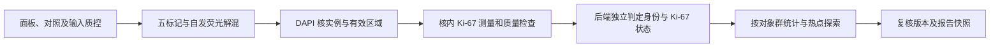

# Ki-67 功能设计：增殖状态与多标记联合分析

[项目手册](PROJECT_GUIDE.md) · [医学概念](guide/02-医学概念与算法边界.md) · [当前实施规格](../SPEC.md) · [当前接口](关键接口设计与流程.md)

**状态：总体目标设计；首期局部 ROI 模拟流程已实现。** 已交付的接口、字段、统计规则与限制以 [Ki-67 实施说明](Ki67实施说明.md) 为准。本文保留后续热点、丰富复核和真实科研验证目标，不能将全部目标当作当前能力。

## 1. 要回答的研究问题

在“对象是什么、多少、在哪里”的基础上，增加“指定对象群中有多少呈现 Ki-67 阳性核信号、分布是否集中、不同区域是否存在差异”。目标面板为 **DAPI＋panCK＋CD3＋CD8＋Ki-67**，即核染料加四项抗体标记；自发荧光是额外解混来源，不计为第六项生物标记。

Ki-67 是与增殖相关的核标记。它提供细胞周期活动的观察线索，不能单独识别肿瘤、给出细胞分裂速度或推断治疗反应。[IKWG：Ki67 的含义](https://www.ki67inbreastcancerwg.org/what-is-ki67/)

设计采用两个相互独立的维度：

| 维度 | 例子 | 用途 |
|---|---|---|
| 对象身份 | 上皮候选、CD3 单阳性候选、CD3⁺CD8⁺ 候选、面板内阴性、无法判定 | 决定统计哪个对象群 |
| Ki-67 状态 | 阳性、阴性、无法判定、未检测 | 描述该对象的核内标记状态 |

“panCK⁺／Ki-67⁺”和“CD3⁺CD8⁺／Ki-67⁺”都可成立。Ki-67 阳性不覆盖原身份，也不视为 panCK/CD3/CD8 冲突。身份不确定时可保留核内测量，但不进入依赖明确身份的分组指标。

默认报告名称为“上皮候选对象 Ki-67 阳性比例”。只有具有适用的病理区域、对象纳入依据和专业复核记录时，才能另报“经确认肿瘤对象 Ki-67 指数”；给 ROI 起名为肿瘤、或仅凭 panCK 阳性，不构成这种确认。首期不输出自动肿瘤诊断或通用高低风险分级。

## 2. 用户流程与页面

1. **导入及能力识别。** 检查 assay 是否声明 Ki-67、参考谱和对照是否适用；五标记数据展示 Ki-67 能力，四标记历史数据展示“未检测”，不能补零。选择 Ki-67 分析但输入不支持时，应在提交前说明缺失项。
2. **配置分析。** 用户选择 ROI、目标对象群、取样方式、经过确认的阈值方案与质控方案。默认对象群是上皮候选；可另选全部有效核、全部 CD3⁺ 候选或 CD3⁺CD8⁺ 候选。显示分母说明与方案版本。
3. **检查图像。** 查看 DAPI、Ki-67 单通道及叠加图、核轮廓和质量图层；身份以轮廓或符号表示，Ki-67 状态以另一种可辨编码表示，并提供图例。
4. **读取统计。** 卡片同时展示阳性数、阴性数、可评价数、无法判定数、未检测数、排除数、比例和覆盖率。点击分子、分母或异常数分别高亮对应对象；显示筛选不改变分析分母。
5. **复核。** 对象详情展示核内强度、测量区、阈值、自动/有效状态及理由。可独立修改对象身份或 Ki-67 状态，或排除对象；修改后生成新版本，显示统计变化。
6. **比较与导出。** 比较两个固定版本的 ROI，并检查面板、测量、阈值、取样方式、对象群和质控是否可比。报告保留选区依据和版本，不把局部 ROI 数值包装为整张切片结论。

### ROI 总体与热点

默认提供 **所选 ROI 内总体计数**：统计该范围内所有合格的目标对象。它不是整切片总体评分，也不等同临床加权全局评分。

热点作为独立的探索模式：在父区域内按固定物理窗口、步长和最低可评价对象数计算局部比例，展示排名和候选窗口，再由研究者确认。记录搜索范围、窗口/步长、最低数量、排序及等值时的确定性规则、候选与确认位置。数量不足的窗口不得靠极小分母登顶；重叠窗口不相加。修改对象或阈值后应生成新的热点候选版本，旧热点报告保持不变。

报告必须明确标注“人工热点”或“算法建议后确认的热点”，并与 ROI 总体并排呈现。热点可作为父区域的子区域，不沿用当前双 ROI 比较对“独立区域”的假设；不得将它与总体合并成样本。乳腺癌 IHC 建议强调评分标准化及取样方法的影响；本设计借鉴可追溯取样原则，不直接移植其临床阈值或宣称 mIF 与 IHC 等效。[IKWG 更新建议](https://pmc.ncbi.nlm.nih.gov/articles/PMC8487652/)

## 3. 图像输入与算法责任

### 输入及实验资料

- 保留 OME-TIFF＋assay 工作流；Ki-67 必须来自真实新增的实验信号，不能从现有四标记推测。
- 目标 assay 新版记录面板 ID/版本、规范标记 ID `Ki67`（显示名 `Ki-67`）、抗体克隆/批次、荧光染料、染色与扫描条件、参考光谱、单染/未染及适用阳性/阴性对照的引用与质控结论。
- 五标记加自发荧光对应六种光谱来源，参考矩阵为 `[6,B]`。顺序必须与来源列表一致，检查有限值、谱秩、条件数和通道对应关系；数学可解仍需实验串色验证。
- 数据契约建议版本 `spectral-mif-research-v2`；允许声明受支持的四标记或五标记面板，不承诺任意面板。v1 输入继续由旧契约解释，不能把旧 `[5,B]` 参考谱误读成含 Ki-67。

### 算法步骤

Python 负责可定量信号、核实例、逐核测量与质量依据；后端负责按版本化规则判定、纳入对象群、统计和复核。Ki-67 测量采用 DAPI 核实例内部，不能复用 panCK/CD3/CD8 的核周扩张区域。需要处理粘连、截断、饱和、串色、核内有效像素不足和异常背景。

首期使用经过背景/校准处理的核内平均强度作为判定特征，同时保存有效像素数与测量单位；后续可评估分位强度或核内阳性面积比例，但改特征必须升级测量方案。保存浮点定量图及核掩膜，PNG 只用于显示；不按每个 ROI 的最大值重新归一化后套用同一阈值。

方案保存 `feature`、`compartment=nucleus`、强度尺度、背景方法、`threshold`、比较运算 `>=`、阈值来源、适用批次和版本。没有通用默认医学阈值；模拟方案可使用明确标注的演示值。信号质量合格且特征 ≥ 阈值为阳性，小于阈值为阴性；质量不合格为无法判定。人工置为无法判定时记录原因。若增加灰区或模型判定，需要另行版本化规则。

质量分对象级和标记级：核无效时对象整体排除；仅 Ki-67 信号不可评价时，不自动删除其余标记结果。整个 Ki-67 通道质控失败时保留其他可用结果，Ki-67 汇总标记不可用，不显示为 0%。

## 4. 统计口径

对固定 ROI、对象群、分析方案和复核版本，先确定在有效区域内、核有效且未整体排除的目标对象集合。使用原图坐标和明确的中心纳入规则；截断核按质量规则处理。对群体内对象计数：

- `positiveCount=P`：有效 Ki-67 阳性数。
- `negativeCount=N`：有效 Ki-67 阴性数。
- `indeterminateCount=U`：检测过但无法判定数。
- `notMeasuredCount=M`：没有该项测量数。
- `evaluableCount=E=P+N`；`targetCount=T=P+N+U+M`。
- `fraction=P/E`，JSON 存 0–1，界面显示 `100×fraction%`；`E=0` 时为 `null`。
- `coverage=E/T`，`T=0` 时为 `null`。对象级排除数及身份无法判定数另列，不隐含进分母。

缺失与不可评价不能作为阴性。通道未检测或整体 QC 失败时 `fraction=null`，附 `status/reason`；未检测时该群对象计入 M，通道失败且有检测时计入 U。设有最小 E 或最低覆盖率要求的方案，应预先固定阈值，未达标时数值只作为标记清楚的探索结果，不能确认正式报告。阈值由验证方案确定，不在平台硬编码通用医学数量。

| 指标 | 分母与解释 |
|---|---|
| 上皮候选 Ki-67 阳性比例（默认） | Ki-67 可评价的上皮候选对象 |
| CD3⁺CD8⁺ 候选 Ki-67 阳性比例 | Ki-67 可评价的 CD3⁺CD8⁺ 候选对象 |
| 全部 CD3⁺ 候选 Ki-67 阳性比例 | 合并 CD3 单阳性和 CD3⁺CD8⁺ 候选中的可评价对象，每个对象一次 |
| 全部有效核 Ki-67 阳性比例 | 所有未排除、核有效且 Ki-67 可评价的对象，包括身份无法判定者；不能命名为肿瘤指数 |
| 经确认肿瘤对象 Ki-67 指数（后续） | 有版本化肿瘤纳入证据且 Ki-67 可评价的对象；没有证据时不生成 |

可选阳性密度为该对象群 P / 同一分析范围的有效组织面积，面积为 0 时 `null`，单位 objects/mm²；不能用面积作阳性比例分母，也不能称其为肿瘤面积密度，除非分母确为经确认的肿瘤区域面积。

教学例子：目标群有 100 个未排除对象，30 阳性、60 阴性、10 无法判定，则 E=90，阳性比例=33.33%，覆盖率=90%，而不是 30%。将一个阳性复核为阴性后为 29/90；将该阳性整体排除则为 29/89，T 同时变为 99。数字仅用于验收算术。

多个不重叠 ROI 的同口径描述性合并用 `ΣP/ΣE`，不直接平均百分比；相同对象不得重复计数。若无共同坐标/身份或重叠无法去重，则拒绝合并。跨病例统计以病例为独立单位另定研究方案，不将核数量当独立病例数；热点、总体与不同取样策略不能直接混合。

## 5. 数据与接口扩展提案

以下是**总体目标字段和语义**；首期采用的具体字段和可调用示例见 [实施说明](Ki67实施说明.md)。新增请求/响应通过显式契约版本路由到新处理逻辑，现有 `/api` 与 `/v1` 行为保持可回放；具体端点落地时再同步接口文档。

| 层次 | 拟议扩展 | 必须校验的关系 |
|---|---|---|
| 图像 / inspect | `panelId,panelVersion,availableMarkers,capabilities.ki67` | 能力由已验证输入推导，不由用户勾选决定 |
| 分析方案 | `contractVersion,measurementVersion,ki67Rule,scoringScope,targetPopulation,qcPolicy` | 固定 Ki-67 特征/阈值、ROI 总体或热点、对象群及最低数量/覆盖率 |
| Python 请求 | 输入哈希、面板/测量版本、ROI、模型与测量配置 | 不依赖人工答案；后端分类阈值无需传给只做测量的步骤 |
| manifest | 实际 marker 列表、Ki67 定量/显示图键、测量版本、通道 QC、输入身份 | 六来源输入对应五标记产物；校验对象/掩膜/测量一致且完整 |
| 对象 | `markerMeasurements.Ki67`、`ki67.autoState/effectiveState/reason` | 测量含 `value,unit,compartment,validPixelCount,quality`，无测量 value 为 null |
| 统计 | `ki67` 按对象群返回 P/N/U/M/E/T、排除数、比例、覆盖率、状态/原因 | 汇总可以从同快照对象表重算 |
| 复核 | `dimension,newValue,reason,baseReviewVersion` | 维度为身份、Ki-67 状态或排除；冲突时拒绝并要求载入新版本 |
| 比较 | 两侧固定版本、Ki-67 专项可比性及原因 | 原有组成比较可继续，Ki-67 不可比时不生成差值 |

建议 Ki-67 状态枚举为 `positive / negative / indeterminate / not-measured`；整体排除是独立状态。未检测不能通过人工状态修改伪造成检测阳性；标记级或对象级硬性 QC 阻断也不能靠改标签解除，需要修正测量/质量依据并生成新版本。

后端发布除现有检查外，还应校验 Ki67 文件的归属/尺寸、来源映射、强度单位及有限值、核内有效像素、对象 ID、输入哈希和测量版本。质量不合格的测量应有原因，不能以 0 伪造有效测量。仅旧结果可用时 UI 不得开启新能力。

### 版本与复算

- 自动测量和自动状态永久保留，人工修改追加记录，保存操作者、时间、原因、维度和前后值；复核版本统一覆盖身份及 Ki-67 两个维度，避免报告混用时点。
- 只改 Ki-67 状态：重算相关比例/密度及热点候选，不改变身份与现有最近邻配对。改身份或整体排除：重算对象群和相关空间指标。
- 改核边界、补录/拆分：生成新对象/测量版本，重新测量与分类；旧状态修订不盲目套用新对象。改阈值：形成新方案和派生结果版本，不能修改已发布任务参数。
- 报告固定输入、面板、ROI/组织区、模型、测量、判定、统计、复核及取样版本。导出和页面使用同一快照。

### 比较与导出

Ki-67 可比性检查包括面板、校准/尺度、测量特征与核区、判定阈值、对象群、质量/纳入规则、取样方式和相关算法版本。任一缺失或不一致时列明原因；可保留带提示的并排查看，不输出 Ki-67 差值或跨区合并。可比时差值以**百分点**表示，例如 40%−30%=10 个百分点，不默认做显著性推断。

新版单 ROI/比较导出继续包含对象、汇总、图层、方法和 QC 文件，并显式标记 `exportSchemaVersion`。对象表新增核内 Ki67 值/单位、自动与有效状态、质量原因、目标群纳入与排除原因；汇总表记录每个对象群的 P/N/U/M/E/T、比例、覆盖率与不可计算原因；method 保存完整方案、对照引用、版本及热点选区依据。JSON 缺值为 null，CSV 数值留空且附原因。旧版 ZIP 契约保留，不能静默增列破坏旧消费者。

## 6. 分阶段交付与验收

| 阶段 | 范围 | 完成依据 |
|---|---|---|
| 一：局部 ROI 科研流程 | 五标记输入/模拟数据、核内测量、独立状态、按群比例、QC、复核、比较与版本化导出 | 新旧面板回归及下列工程验收通过 |
| 二：取样与丰富复核 | 热点建议/确认、组织和对象几何修改、肿瘤纳入依据、多 ROI 去重汇总 | 取样追溯、重测量、去重及历史快照可复算 |
| 三：真实科研验证 | 真实染色对照、专业标注、跨批次评价和用途确认 | 独立测试与误差分析支持约定研究用途 |

首期不得以自动热点、肿瘤指数或全切片评分作为默认交付承诺。后续模型可独立升级，必须保持已声明的测量和统计语义。

工程验收至少覆盖：

1. 五标记正常输入、Ki-67 缺谱/错位/退化谱、无效数值与不匹配面板；旧四标记数据仍可分析且 Ki-67 为未检测。
2. 核外强 Ki-67 不计入该核；核重叠、截断、饱和与通道失效正确形成质量结果；显示亮度调整不改变测量或分类。
3. Ki-67 阳性上皮与阳性 T 细胞同时存在，原身份不被覆盖；仅 Ki-67 无法判定不清除原身份。
4. 上述 30/90 算例、全阴性为 0%、全阳性为 100%、E=0 为 null、目标群为空、通道未检测/失效和最低数量/覆盖率不足。
5. 状态复核、身份修改、整体排除的重算正确；旧版本不变、并发旧版本修改被拒绝、页面与 ZIP 数值及对象集合一致。
6. 比较缺失通道、阈值/口径不同、重叠 ROI；不兼容时无 Ki-67 差值；可比差值采用百分点。
7. 热点阶段验证搜索范围、物理窗口、最低数量、确定性排序、重叠不累加及人工确认记录。

新增合成数据应同时生成 Ki-67 核内信号、单染对照、独立强度/阳性真值及难例，不把分析输出当真值，不把真值输入推理。真实验证按病例和批次独立划分，分别评估核分割、标记信号归属、阳性判定、最终指数误差和复核一致性；验收阈值由研究方案预先确定，工程测试不能替代医学验证。

## 7. 依据与适用边界

医学定义参考 [IKWG Ki67 说明](https://www.ki67inbreastcancerwg.org/what-is-ki67/)；评分标准化与适用范围参考 [IKWG 2021 更新建议](https://pmc.ncbi.nlm.nih.gov/articles/PMC8487652/)（查阅：2026-10-02）。后者主要针对乳腺癌免疫组化，不能直接作为本平台多癌种光谱 mIF 的验证依据。本文的字段、默认对象群、状态模型和交付阶段均为本平台的工程设计决策。
