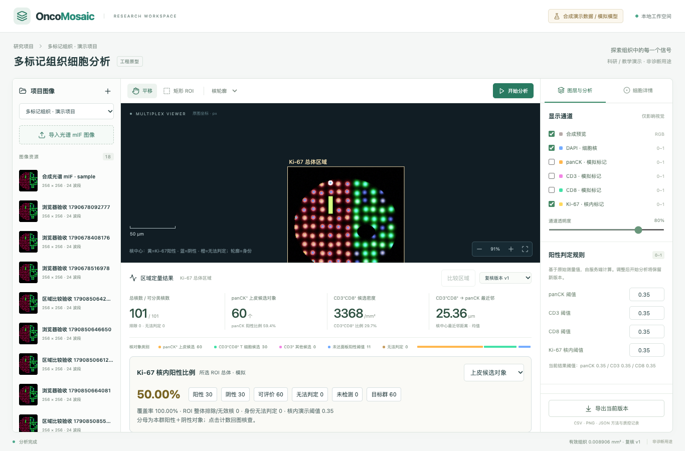

# Ki-67 首期实现与接口

[完整目标设计](Ki67功能设计.md) · [当前规格](../SPEC.md) · [项目手册](PROJECT_GUIDE.md)

已实现局部 ROI 的确定性模拟流程：五标记输入、核内测量、独立状态、四类对象群统计、回图筛选、人工复核、历史回放、同图双 ROI 比较及 v2 导出。算法不具备医学性能验证。热点、几何修订、肿瘤对象确认、多 ROI 合并和正式报告确认流程仍未实现。

## 运行与演示

运行 `docker compose up --build -d`。默认新增“Ki-67 五标记 · 合成演示”，根据 assay 哈希生成独立图像 ID；旧数据库、图像和任务保留。已有工作空间可能仍选中旧图像，需在图像列表选择 Ki-67 样例。

五标记样例为 `data/sample-ki67.ome.tiff` 与 `.assay.json`，对照为 `data/controls-ki67/`，独立真值为 `.truth.json` 和 `.truth.ome.tiff`。四标记样例 `sample-spectral-mif.*` 保留。重新生成五标记样例：

```bash
.venv/bin/python scripts/generate_demo_hsi.py --ki67 --output data/sample-ki67.ome.tiff
```

选择五标记图像，保存 ROI，设置 Ki-67 核内演示阈值（初始 0.35，无医学意义），开始分析。结果页选择上皮候选、全部 CD3⁺ 候选、CD3⁺CD8⁺ 候选或全部有效核，点击阳性/阴性/可评价/无法判定/未检测/目标群计数定位对象。显示筛选不改统计分母。

对象详情分别显示身份与 Ki-67 自动/有效状态；填写原因后可单独提交 Ki-67 复核。DAPI 和 Ki-67 可叠加查看；开启 Ki-67 通道后，核中心点以黄/蓝/橙分别表示阳性/阴性/无法判定，轮廓仍表示原身份。旧四标记图像禁用 Ki-67 通道并显示未检测。



## 面板与单次 Python 调用

- v1：`schema=spectral-mif-research-v1`，固定 `DAPI,panCK,CD3,CD8,autofluorescence`，模型 `spectral-mif-sim-v1`，旧输出和历史任务继续可用。
- v2：`schema=spectral-mif-research-v2` 支持上述四标记或 `DAPI,panCK,CD3,CD8,Ki67,autofluorescence`；五标记对应 `[6,B]` 参考光谱，模型 `spectral-mif-sim-v2`。光谱秩、条件数、文件哈希、输入尺寸等均校验。
- 同一次 `/v1/analyze` 完成所有解混、DAPI 核分割与测量。Ki-67 使用核内平均强度，panCK/CD3/CD8 保持核周近似测量。
- v2 逐对象增加 `ki67Value`（nullable）、`ki67Quality`、`ki67ValidPixelCount`。五标记 manifest 增加 `Ki67` 显示 PNG 和 `ki67QuantitativeKey`（float32 NPY），后端核对定量图尺寸、范围及逐核均值，核对输入身份的图像/assay 哈希、ROI 和模型版本。
- `qc.ki67` 记录核内测量版本、单位与通道状态。模拟 QC 以有效组织平均光谱残差 >0.08 判通道失败；逐核残差 >0.08、原始波段值 ≥0.995 或裁剪边缘分别标记质量问题。仅 Ki-67 失败时保留其他标记测量。这些是模拟规则，不代表真实病理质量标准。

## HTTP 请求与返回

图像 DTO 增加 `capabilities.ki67`，从已校验 assay 推导。创建五标记任务：

```json
{
  "imageId": "<image UUID>",
  "roiId": "<ROI UUID>",
  "modelVersion": "spectral-mif-sim-v2",
  "thresholds": {"panck": 0.35, "cd3": 0.35, "cd8": 0.35, "ki67": 0.35}
}
```

模型 v2 对应 `algorithmVersion=quantification-v3`；Ki-67 阈值必须有限且在 0–1。五标记须提供 Ki-67 阈值并使用 v2；四标记不能提交该阈值。不符合时返回 `400 INVALID_KI67_SCHEME`。Python 请求路径与原有字段不变，阈值仍由后端使用。

`cells/exploration` 对象增加 `ki67`：`value,unit,compartment,validPixelCount,quality,autoState,effectiveState`。状态为 `positive/negative/indeterminate/not-measured`，独立于原有身份标签与整体排除。`summary.ki67` 使用 `panck/cd3/cd3-cd8/all` 四个键，其中 `cd3` 是全部 CD3⁺ 候选的并集；它与旧 `counts.cd3Only` 的单阳性口径不同。

每组返回 `positiveCount,negativeCount,indeterminateCount,notMeasuredCount,evaluableCount,targetCount,excludedCount,identityUnclassifiedCount,fraction,coverage,positiveDensity,status,reason`：

- 目标群排除整体排除和核质量异常对象；`all` 仍纳入核有效但身份无法判定的对象。
- `E=P+N`，`T=P+N+U+M`，`fraction=P/E`、`coverage=E/T`；零分母为 null，不补零。
- `excludedCount` 和 `identityUnclassifiedCount` 是 **ROI 总体上下文计数**，每个对象群中重复提供，不能跨群相加；排除对象没有可靠的最终群归属。
- `status` 为 `empty/not-measured/unavailable/exploratory/ok`。模拟门槛固定为 E≥10、coverage≥0.8，否则标注探索结果及原因；当前没有正式医学报告确认流程。
- 阳性密度 P/有效组织 mm²；E=0 时密度也为空，避免未测被显示为 0。

复核沿用 `POST /api/analysis-runs/{id}/reviews`，新增维度与基础版本：

```json
{
  "cellId": "<cell UUID>",
  "dimension": "ki67",
  "newLabel": "negative",
  "reason": "模拟复核示例",
  "baseReviewVersion": 0
}
```

`dimension` 默认 `identity`，保持旧请求兼容；`ki67` 允许阳性、阴性、无法判定三种状态。v2 任务的所有复核都要求 `baseReviewVersion`，缺失返回 `400 REVIEW_VERSION_REQUIRED`，版本过时返回 `409 REVIEW_CONFLICT`。Ki-67 修改要求非空原因；未检测、核质量异常或 Ki-67 质量不合格返回 `409 KI67_NOT_REVIEWABLE`。当前是无认证本地工作空间，方法记录标注 `local-user`，不宣称具备多人身份审计。

同一个复核序列分别应用各维度的最新修改。只改 Ki-67 状态不改变身份和最近邻；整体排除或身份修改重算群体指标。改阈值通过创建新任务保留新版本，不修改历史任务。

## 比较和导出

双 ROI 仍限同图不同 ROI，继续提示重叠。`comparison.ki67` 返回 `comparable,reasons,differencePercentagePoints`。模型、统计版本、全部判定阈值或 assay 不一致，或缺少 Ki-67 方案时，专项比较不可比且差值全部为 null；其他组成指标仍可查看。可比时按各群计算 `(A−B)×100` 个百分点；任一群无可计算比例时，该群差值为空。小样本探索标志在两侧保留，不做显著性推断。

两个导出端点都支持 `exportSchemaVersion=1|2`：

- 缺省 1：保留旧 ZIP 文件集合及 CSV 列。
- 显式 2：单 ROI 增加 `ki67-cells.csv`、`ki67-summary.csv`、存在时的 `Ki67.png`、`Ki67-quantitative.npy` 与 `mask.npy`；比较包增加两侧 `ki67-cells-A/B.csv`、`ki67-summary-A/B.csv`。
- `method.json` 记录导出版本和 Ki-67 方案；比较包另记录专项可比性和各群百分点差。页面导出一律显式提交 v2 和当前复核版本。
- 对象 CSV 记录原始核内值、单位、自动/有效状态、质量、身份与排除；结合固定 `roi-total` 和群体规则可还原纳入对象。空值在 CSV 留空，在 JSON 为 null。

示例：`GET /api/analysis-runs/{id}/export?reviewVersion=1&exportSchemaVersion=2`。比较使用 `POST /api/images/{id}/comparisons/export?exportSchemaVersion=2`，请求体仍为两侧固定任务与复核版本。未知导出版本返回 `400 INVALID_EXPORT_VERSION`。

## 数据升级

EF migration `Ki67Measurements` 增加可空 Ki67 值、质量、有效像素数及复核维度。已有对象回填 `not-measured`，历史复核回填 `identity`；不会伪造历史 Ki-67 测量。新演示使用独立图像 ID，不覆盖旧图像。五标记输入不允许交给旧模型。

验收入口：`inference/tests/test_ki67.py`、`backend/OncoMosaic.Tests/Ki67Tests.cs`、`frontend/src/Ki67Panel.test.tsx`、`frontend/e2e/ki67.spec.ts`。浏览器实测数据见 [Ki-67 工程验收](ki67-verification.json)，仅证明模拟工程行为。
