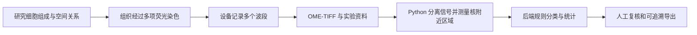
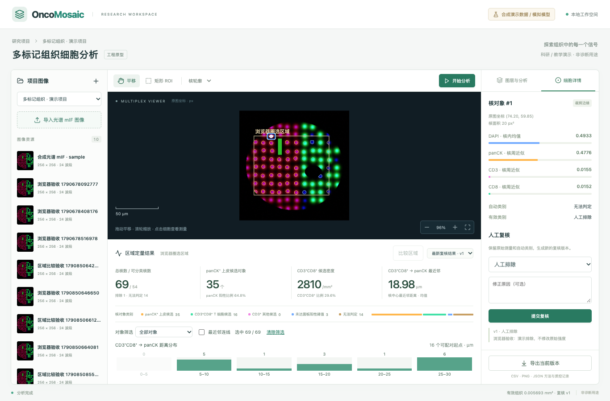

# OncoMosaic 项目学习与讲解手册

这份手册围绕一个研究问题展开：肿瘤相关组织中有哪些上皮与 T 细胞候选对象，它们有多少、分布在哪里、彼此有多接近？先了解这个问题为什么值得研究，再理解 DAPI、panCK、CD3、CD8 怎样配合，以及平台怎样把图像转成可核查的数据。你不需要先懂病理学或深度学习。

当前项目模拟多重免疫荧光光谱图像的科研分析。输入是 **OME-TIFF 图像＋assay 伴随文件**，仓库图像、对照与参考真值均由程序合成。Python 使用参考光谱和确定性规则；没有训练出的医学模型，也没有真实病理性能证据。

第 01、02、06 章侧重理想平台的架构、功能与面试讲解；第 03、04、05 章先讲目标流程和设计取舍，再给出当前操作、接口或实施范围。各章明确标注目标与现状，实际交付证据仍以 SPEC 和验收记录为准。

**想先讲清项目建议读：** [00 项目背景与研究故事](guide/00-项目背景与研究故事.md)。它连接原始项目背景、现有面板、一个教学报告和平台定位，说明为什么四标记面板能支持细胞组成与空间定量。

**完全零基础建议先读：** [从一张组织图像开始：平台入门](平台入门：写给没有医学背景的读者.md)，理解组织、染色和图像，再读第 00 章串联故事，最后进入专题章节。

## 按问题选择阅读入口

| 你想弄明白什么 | 建议阅读 | 本章会讲到 |
|---|---|---|
| 为什么做这个项目，四个标记能回答什么？ | [00 项目背景与研究故事](guide/00-项目背景与研究故事.md) | 原始研究思路、面板分工、联合表型、双区域教学案例与当前范围 |
| 完全没有医学基础，标记和细胞是什么意思？ | [02 医学知识与理想算法功能](guide/02-医学概念与算法边界.md) | 平台必备医学概念、理想分析功能、所需数据、输入输出与验收目标 |
| 有图像后怎样操作，报告应该怎么看？ | [03 核心功能与截图演示](guide/03-核心功能与截图演示.md) | 目标用户流程、实际双 ROI 比较、距离分布与对象联动，以及复核和导出操作 |
| Python 到底接收什么、返回什么？ | [04 实现原理与流程图](guide/04-实现原理与流程图.md) | 目标接口语义、发布与模型替换，以及当前 HTTP 和文件契约 |
| 前端、后端、数据库和 Python 怎样分工？ | [01 项目架构与数据模型](guide/01-项目架构与数据模型.md) | 目标模块职责、实体关系、坐标、任务生命周期与修订重算 |
| 测试通过能证明什么，怎样升级真实模型？ | [05 技术要点与工程取舍](guide/05-技术要点与工程取舍.md) | 目标设计取舍、性能与可靠性、验证层次和分阶段交付 |
| 怎样准确对外介绍这个项目？ | [06 面试话术与追问](guide/06-面试话术与追问.md) | 30 秒/2 分钟/5 分钟介绍、40 个问答及综合场景演练 |

第一次学习建议按 **入门 → 00 → 02 → 03 → 04 → 01 → 05 → 06** 阅读。要先启动程序，可直接看 [README](../README.md)；准备输入或对接接口时，再对照 [SPEC](../SPEC.md)。

准备面试建议按 **00 → 06 → 01 → 02 → 05** 阅读，再用第 03、04 章准备产品和接口例子。先说明研究问题和面板选择，再介绍架构。第 06 章的讲解围绕目标方案；实际职责和成果请结合已有交付证据陈述。

## 贯穿全文的一条线

仓库中的前两步由模拟生成器代替真实实验。后续服务与界面可以运行，但数值含义仍受模拟方法限制。

阅读时始终区分三件事：**医学概念**说明真实研究想观察什么；**当前实现**说明代码实际计算了什么；**未来验证**说明要把两者可靠联系起来还缺什么。各章的教学假设数值会明确标注，不代表样例输出或医学正常范围。

## 当前运行证据

截图由浏览器验收流程产生，用于展示导入、ROI、四标记分析、对象复核和统计界面。它证明工作流可运行，不证明医学识别正确。

[验收记录](VERIFICATION.md) · [机器可读 API 结果](api-verification.json) · [合成数据生成器](../scripts/generate_demo_hsi.py)

## 本轮新增：让双区域故事可以实际演示

当前支持同图像双 ROI 的组成/密度/距离对照、指标到对象高亮、逐对象最近邻连线和固定版本比较导出。先读[操作与读图说明](guide/03-核心功能与截图演示.md#7-多区域比较与对象联动探索)，再看[一致性实现](guide/04-实现原理与流程图.md#8-比较与对象探索怎样保证一致)与[本地验收](VERIFICATION.md)。算法继续模拟，范围仍是四标记局部视野。
