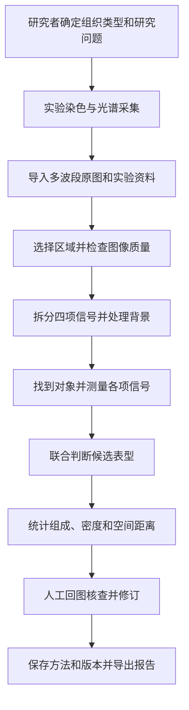

# 00 项目背景与研究故事

[返回手册](../PROJECT_GUIDE.md) · [零基础入门](../平台入门：写给没有医学背景的读者.md) · [医学与算法详解](02-医学概念与算法边界.md)

OncoMosaic 的理想目标，是帮助研究者分析肿瘤组织中的细胞组成和空间关系：**在同一张多标记组织图像中找到对象，联合判断它们的候选表型，计算数量、密度和位置关系，并让每个数字都能回到图像核查。** 本章用现有 DAPI、panCK、CD3、CD8 面板讲清这个故事。教学例子用于解释设计，不代表真实实验结果或当前样例输出。

## 1. 从原始项目的研究问题出发

2021 年的原始立项材料关注肿瘤微环境：研究者既想知道组织中有哪些细胞或分子标记，也想保留它们在组织原位的位置。原始路线将多标记染色、光谱成像与信号拆分、细胞识别和定量统计连接起来。后续材料又提出把分析能力、图像管理和人工查看集成为平台。

本章承接的是这条整体研究思路。它不表示当前仓库已经复现原项目全部算法、成果或后续扩展设想。原立项材料曾提出超过五种标记的目标；当前固定面板的规模尚未达到该目标，但已能用于说明多项标记联合识别与空间定量的流程。

对初学者而言，先理解一个具体问题：

> 在经过专业确认的肿瘤相关区域内，T 细胞候选对象有多少？其中 CD3⁺CD8⁺ 对象怎样分布？它们与上皮候选对象有多接近？

这里“肿瘤相关区域”说明样本和研究范围，“上皮候选对象”说明现有面板提供的身份线索。正常上皮也可能表达 panCK；要确认恶性细胞或肿瘤区域，还需适用于该组织的病理证据。

历史材料依据：2021 年《多靶点标记的肿瘤组织细胞定量化识别分析方法研究》立项申请书、2022 年中期汇报表、结题申请书及“国创计划”推荐意见表。原文件尚未归档到本仓库。本章提炼其中的研究路线；原项目的效果宣称不作为当前平台的性能证据。

## 2. 为什么数量和位置要一起看

肿瘤微环境包括肿瘤周围的正常细胞、分子和血管等成分。研究时会同时关注肿瘤及这些周围成分，尤其是免疫细胞的组成和位置。[NCI 肿瘤微环境词典](https://www.cancer.gov/publications/dictionaries/cancer-terms/def/tumor-microenvironment)

设想两个组织区域都找到 20 个 CD3⁺CD8⁺ 候选对象。只看数量，它们一样；一个区域面积较小，密度会更高；即使面积也相同，这些对象还可能分别集中在上皮候选对象附近或远处。需要面积和坐标，才能描述这些差别。

多标记组织成像与空间分析已有相应研究路线，例如利用高光谱图像分析 T 细胞亚群及其组织空间分布。它支持本平台的选题方向，但不能替代对本平台的验证。[高光谱细胞空间分析原始研究](https://pmc.ncbi.nlm.nih.gov/articles/PMC6335759/)

## 3. 四个标记怎样共同回答问题

这里常说“四标记面板”，更具体是 **DAPI 核染料＋panCK、CD3、CD8 三项抗体标记**。它们是图像中的观察线索；密度、比例和距离才是分析后得到的统计指标。

| 标记 | 提供的线索 | 对研究故事的作用 |
|---|---|---|
| DAPI | 细胞核的位置和形态 | 帮助定位对象，把其他信号关联到同一个对象 |
| panCK | 上皮来源相关特征 | 建立上皮候选对象集合，作为组成和空间分析的一类对象 |
| CD3 | T 细胞相关特征 | 建立 T 细胞候选对象集合 |
| CD8 | 配合 CD3 描述 CD8⁺ T 细胞亚群 | 从 T 细胞候选中进一步区分研究关注的亚群 |

DAPI 的作用见[核染料说明](https://www.thermofisher.com/de/en/home/life-science/cell-analysis/fluorophores/dapi-stain.html)；上皮与 T 细胞标记的进一步资料见[第 02 章](02-医学概念与算法边界.md)。

四张标记图应对应同一视野、同一坐标系。先找到一个核，再检查属于这个对象的 panCK、CD3、CD8 信号，才有依据说“这个对象同时满足 CD3 和 CD8 的阳性条件”。分别发现一个 CD3 亮点和另一个 CD8 亮点，并不能说明存在一个双阳性细胞。

“⁺”表示信号达到指定阳性条件，“⁻”表示未达到。以下只是便于理解的组合示例，实际还需检查形态、信号归属和质量：

| 同一个对象的观察 | 可以形成的候选判断 |
|---|---|
| panCK⁺、CD3⁻、CD8⁻ | 上皮候选对象 |
| panCK⁻、CD3⁺、CD8⁺ | CD3⁺CD8⁺ T 细胞候选对象 |
| panCK⁻、CD3⁺、CD8⁻ | CD3 单阳性 T 细胞候选对象；不能因此直接称为 CD4⁺ |
| 三项均未达阈值 | 对这三项标记阴性的对象，具体身份仍未知 |
| 身份线索冲突、信号混入或边界不清 | 待复核或无法判定 |

CD3⁺CD8⁺ 描述的是标记组合，不能单凭它证明细胞正在杀伤肿瘤。现有面板也没有覆盖微环境中的全部细胞种类。

## 4. 一次理想分析怎样进行

**实验提供信号。** 抗体帮助检测 panCK、CD3、CD8 对应的目标，荧光染料让检测产生光信号；DAPI 用于核染色。平台需要实验与采集资料才能解释原图。

**光谱解混区分来源。** 每个像素可能同时收到几个荧光来源和组织自发荧光。参考光谱帮助算法估计各来源的贡献，再形成各项标记图。24 个采集波段是 24 份光谱观测，并非 24 个靶点；自发荧光也不算新增抗体标记。

**对象分析建立归属。** 分割是给对象圈出所属像素；测量是从合适区域取出标记强度；表型判定是按这些测量及其他依据给对象分类。三步分别回答“边界在哪”“信号多少”“属于哪类”。

**报告保留证据。** 研究者应能从某个计数查到对应对象，再在通道图上核查边界和信号。修订后保存新版本，让图、对象表与汇总一致。[SITC 图像分析建议](https://pmc.ncbi.nlm.nih.gov/articles/PMC11749220/)

## 5. 用一份教学报告理解数字

假设区域 A、B 均有 0.10 mm² 有效组织、100 个可分类对象和 20 个 CD3⁺CD8⁺ 候选对象。以下数字全部是假设，只展示如何读报告；计数不含排除及无法判定对象。

| 指标 | 区域 A | 区域 B | 能描述什么 |
|---|---|---|---|
| CD3⁺CD8⁺ 候选对象数量 | 20 | 20 | 找到了多少个 |
| 占全部可分类对象的比例 | 20% | 20% | 在明确分母中的组成 |
| 有效组织内密度 | 200 个/mm² | 200 个/mm² | 每单位面积的数量 |
| 到最近上皮候选对象的平均核中心距离 | 12 µm | 40 µm | 两类对象的空间接近程度 |

可得出的描述是：在此假设中，两区域的数量、比例与密度相同，但 A 中这类对象到上皮候选对象的平均最近邻距离较小。不能据此直接得出 A 的治疗效果更好或免疫杀伤更强。

“20%”的分母是全部可分类对象。若要计算“在 T 细胞候选中占多少”，分母要改为对应 T 细胞集合，报告也要换名称。当前默认汇总采用前一种口径。

最近邻计算有方向：从每个 CD3⁺CD8⁺ 对象找最近的上皮候选对象，再汇总距离。反方向会使用另一组起点，通常不是同一个结果。目标集合为空时无法计算；ROI 外未被纳入的邻居也可能影响观察到的距离。比较前应固定区域选择与边缘处理规则。

## 6. 为什么可以称为多靶点定量分析平台

| 项目名中的含义 | 这个故事对应的能力 |
|---|---|
| 多靶点标记 | 在同一组织图像中观察多个标记，并把它们关联到同一对象 |
| 肿瘤组织 | 分析肿瘤相关样本中的上皮与免疫候选对象，不限于恶性细胞本身 |
| 细胞识别 | 定位对象，并依据标记组合形成可核查的候选表型 |
| 定量化分析 | 将图像观察转成带分母和单位的数量、比例、密度与空间结果 |
| 平台 | 连接数据导入、分析、查看、复核、版本记录和导出 |

这套固定面板已经能支撑一个范围明确的研究问题。扩展更多标记应由新的研究问题驱动；目前更重要的是把信号分离、对象归属、区域面积和表型判定做可靠。

## 7. 理想故事与当前原型如何对应

| 理想能力 | 当前原型的对应范围 |
|---|---|
| 分析真实实验数据 | 仓库演示数据全部合成，真实图像性能尚未验证 |
| 可靠定位细胞并测量 | 通过 DAPI 阈值检测核，用核及核周近似区域测量；没有可靠全细胞分割 |
| 组织区域与身份确认 | 当前估计有效组织，没有自动确认恶性细胞或细分肿瘤/间质区域 |
| 组成和空间报告 | 已实现候选类别计数、比例、有效组织密度及定向最近邻核中心距离 |
| 复核和追溯 | 已实现已有对象的类别修改、排除、历史版本和导出；丰富几何编辑仍是目标 |

对外介绍理想平台时可以先说明研究目标，再说明这套面板如何回答问题；介绍当前成果时，应补充合成演示和核周近似测量的范围。[当前规格](../../SPEC.md)

## 8. 一分钟讲清平台

> 我们希望研究肿瘤组织中的细胞组成和空间关系。平台分析同一视野中的 DAPI、panCK、CD3、CD8 信号：先定位细胞核，再根据标记组合识别上皮和 T 细胞候选对象，计算它们的数量、密度及相互距离。研究者可以从统计数字回到对象和原图，检查或修正结果，最后导出带方法和版本的报告。当前原型用合成光谱图像演示这套流程；真实科研能力需要在实验数据和专业参考标注上验证。

继续阅读：[零基础入门](../平台入门：写给没有医学背景的读者.md) · [医学知识与算法功能](02-医学概念与算法边界.md) · [项目介绍与追问](06-面试话术与追问.md)
