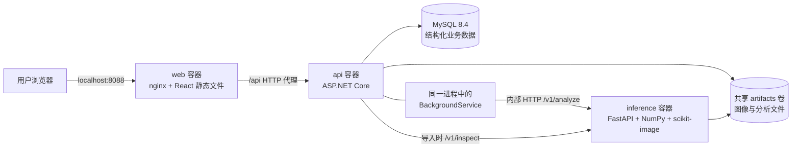
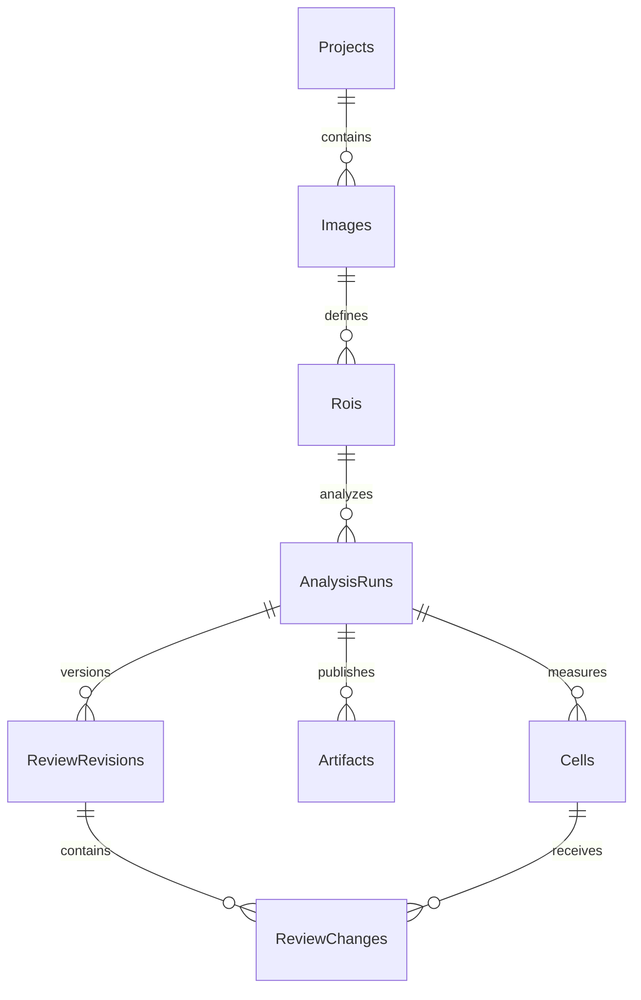
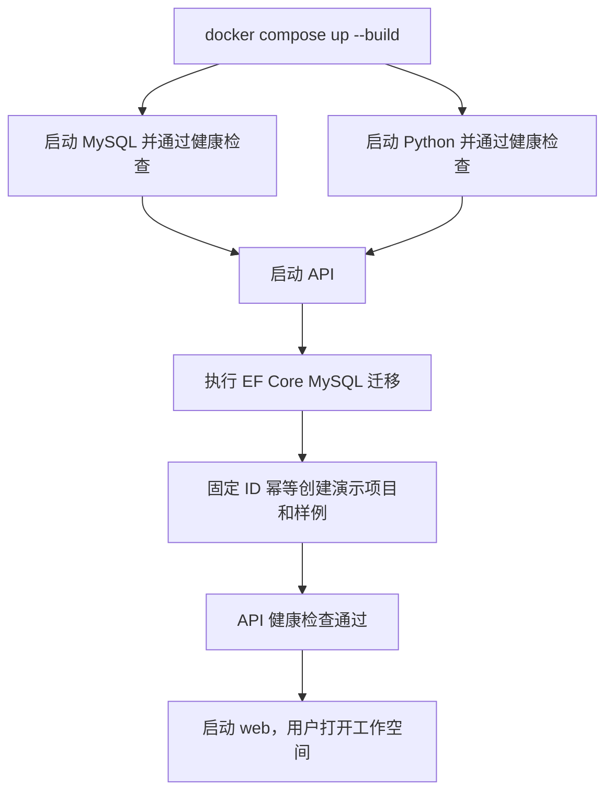

# 01 项目架构与数据模型

[返回手册](../PROJECT_GUIDE.md) · [下一章：医学概念](02-医学概念与算法边界.md)

## 1. 项目解决什么问题

OncoMosaic 把一份多波段合成图像转为可查看、可复核、可导出的单核对象测量结果。它的核心价值是把图像工具、算法调用、结构化结果和人工修正连成一个可重复运行的流程。

用户不需要手动运行 Python 或写数据库：上传文件、圈选区域、提交分析即可得到结果。服务端保留任务与测量，浏览器刷新、容器重启后仍可继续查看。当前是单用户、单 API/worker 实例的本地工程原型。

## 2. 部署架构



图中的后台 worker 是 **API 进程内的托管服务**，不是第五个容器，也不是独立消息中间件。Compose 共四个服务：`web`、`api`、`inference`、`db`。

只有 nginx 绑定宿主机的 `127.0.0.1:8088`。浏览器通过同源 `/api` 访问后端，API 和 Python 通过 Compose 内网通信；数据库和 Python 没有对宿主机开放端口。实现见 [compose.yaml](../../compose.yaml) 与 [nginx.conf](../../frontend/nginx.conf)。

## 3. 职责边界

| 模块 | 负责 | 与其他模块的边界 |
|---|---|---|
| React / TypeScript | 页面状态、鼠标交互、通道显示、轮询、结果展示 | 不自行推断细胞，不重新计算医学统计 |
| ASP.NET Core API | 参数验证、项目/图像/ROI、任务、规则、复核、导出 | 对浏览器提供唯一业务入口 |
| BackgroundService | 读取持久任务、调用 Python、检查产物、事务入库 | 初版只支持一个领取者 |
| Python FastAPI | NPZ 检查、预览、模拟标记图、核检测、强度测量 | 不知道项目归属、复核类别或用户规则 |
| MySQL / EF Core | 对象关系、任务状态、测量值、版本与文件索引 | 不存储整个高光谱数组 |
| 文件卷 | NPZ、PNG、NPY、JSON | API 按资源 ID 查文件，不让浏览器提交磁盘路径 |

这样的拆分让 Python 图像处理可以单独替换，业务统计和审计规则仍留在后端。真实模型未来可实现同一个 adapter 协议，但仍需另外验证数据适配、测量口径与医学性能。

## 4. 数据关系



| 表 | 核心字段与用途 |
|---|---|
| `Projects` | 项目 ID、名称、创建时间 |
| `Images` | 项目 ID、原始文件键、SHA-256、尺寸、波长、像素尺寸、预览键 |
| `Rois` | 图像 ID、原图坐标、宽高、名称、区域标签；当前保存后不提供编辑接口 |
| `AnalysisRuns` | ROI ID、状态、attempt、模型/算法版本、阈值快照、错误与时间 |
| `Cells` | run ID、localIndex、中心、面积、三项原始强度、质量标志、轮廓 JSON |
| `ReviewRevisions` | run ID、递增复核版本与创建时间 |
| `ReviewChanges` | revision ID、cell ID、新标签、原因；当前一次请求修正一个细胞 |
| `Artifacts` | run ID、产物类型、文件键与校验值 |

实体和映射见 [Domain.cs](../../backend/OncoMosaic.Api/Domain.cs)。注意两个容易误讲的细节：

- 自动标签不是 `Cells` 中另一个被人工覆写的列；读取时根据该 run 的阈值和保存的原始强度推导。
- 当前没有单独的“规则版本表”。改变阈值再分析会创建新的 `AnalysisRun`，旧 run 的阈值 JSON 保持不变。

三个唯一约束分别是 `(runId, localIndex)`、`(runId, reviewVersion)`、`(runId, artifactKind)`，对应细胞去重、复核版本去重和产物类型去重。

## 5. 文件布局与发布

```text
/store/
  staging/<临时ID>/
    source.npz
    preview.png
  images/<imageId>/
    source.npz
    preview.png
  runs/<runId>/
    markers/DAPI.png
    markers/panCK.png
    markers/CD8.png
    nuclei-mask.npy
    nuclei-overlay.png
    cells.json
    manifest.json
```

Python 分析过程中使用 `runs/.<runId>-<随机后缀>/` 临时目录，完成后重命名为正式目录。API 读取 manifest 后验证文件，再在一个数据库事务中写入结果。

这形成“文件先发布、数据库后引用”的顺序，**不等于文件系统与 MySQL 之间存在跨资源事务**。异常时可能出现尚未被数据库引用的文件；同一个 run 的重试可复用已完成的产物，通用孤立文件回收还未实现。

ZIP 导出在 API 内存中即时生成；当前没有把每份 ZIP 作为长期缓存写入 `Artifacts`。可重复导出指同版本的结果口径可重现，不保证压缩包字节完全一致，因为记录了生成时间。

## 6. 启动与持久化



`database` 卷持久化 MySQL，`artifacts` 卷同时挂载给 API 和 Python。启动初始化使用固定的演示项目、图像 ID，因此不会每次新增一份演示数据。用户再次主动上传相同文件仍会创建新图像；SHA-256 目前主要用于追溯，并没有实现全库内容去重。

## 7. 源码走读入口

| 阅读目标 | 文件 / 关键入口 |
|---|---|
| 外部 API 与启动逻辑 | [Program.cs](../../backend/OncoMosaic.Api/Program.cs) |
| 数据模型与约束 | [Domain.cs](../../backend/OncoMosaic.Api/Domain.cs) |
| 文件边界与导入 | [Storage.cs](../../backend/OncoMosaic.Api/Storage.cs)：`ImportService.Import` |
| 任务与结果发布 | [AnalysisWorker.cs](../../backend/OncoMosaic.Api/AnalysisWorker.cs) |
| 模拟算法 | [model.py](../../inference/app/model.py)：`MockSpectralAdapter` |
| 统计公式 | [Quantification.cs](../../backend/OncoMosaic.Api/Quantification.cs) |
| 复核视图与导出 | [Results.cs](../../backend/OncoMosaic.Api/Results.cs)：`Snapshot` / `Export` |
| 查看器交互 | [Viewer.tsx](../../frontend/src/Viewer.tsx)、[geometry.ts](../../frontend/src/geometry.ts) |

[下一章：医学概念与算法边界](02-医学概念与算法边界.md)
