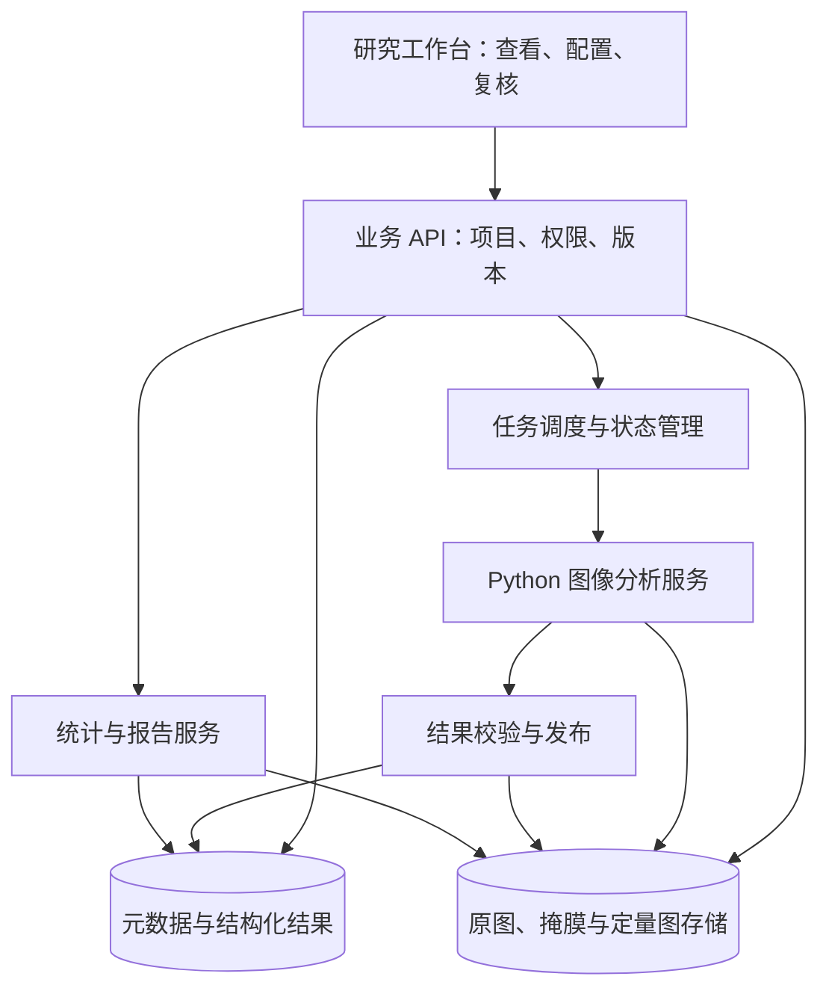

# 01 平台架构与数据模型

[返回手册](../PROJECT_GUIDE.md) · [研究故事](00-项目背景与研究故事.md) · [下一章](02-医学概念与算法边界.md)

本章先说明理想平台的架构和数据关系，最后说明当前工程的对应范围。设计目标是让一次分析中的图像、实验资料、算法结果、人工修订和报告保持一致，而不是只把模型包装成一个上传接口。

先用一个业务例子理解架构：研究者看到“CD3⁺CD8⁺ 候选对象密度为 200 个/mm²”的教学报告，应能查到它来自哪个 ROI、哪 20 个对象、0.10 mm² 面积怎样取得，以及这些对象怎样由 CD3/CD8 信号判定。前端展示依据，算法产生区域和测量，后端保存关系、计算统计并固定报告版本。各模块共同支撑这条追溯路径。

## 1. 从业务职责划分模块

| 模块 | 负责什么 | 为什么需要独立的职责 |
|---|---|---|
| 研究项目与样本管理 | 项目、样本、切片、视野、研究分组和访问范围 | 同一患者或样本的多个视野不能被误当成独立病例 |
| 图像与实验资料管理 | 原图、面板、设备、波长、批次、对照与校准 | 像素含义依赖实验条件，仅有图片不足以解释结果 |
| 图像查看与 ROI | 通道、区域、轮廓、坐标、缩放和范围选择 | 用户应能回到原图核查每个结果 |
| 分析任务管理 | 配置、调度、状态、失败、重试和版本 | 长时间计算需要独立生命周期 |
| 算法服务 | 质控、光谱处理、分区、分割、测量和表型 | 图像计算与业务流程可以独立升级 |
| 复核与统计 | 人工修改、受影响结果重算、区域与空间汇总 | 修订应真实改变统计，并保留过程 |
| 报告与审计 | 快照、导出、方法、操作记录和历史比较 | 使用者需要知道数字由什么输入和方法产生 |

## 2. 推荐的逻辑架构



这是逻辑分工，不要求初期部署为许多独立微服务。小规模可在业务后端内实现任务和报告模块；随着数据量或团队规模增长，再独立扩展确有需要的部分。

前端接触图像标识和受控资源地址，不直接操作服务器目录。算法处理受控文件或对象存储引用，并返回结果清单。业务后端负责确认结果属于哪个任务、能否发布和谁可以查看。

## 3. 数据应怎样组织

### 3.1 样本层次

```text
研究项目
  └─ 样本
      └─ 组织切片
          └─ 图像 / 局部视野
              └─ ROI 版本
                  └─ 分析任务
                      └─ 自动结果
                          └─ 人工修订版本
                              └─ 报告快照
```

这是常见关系示意。一个样本可有多个切片，一个图像可有多个 ROI，同一 ROI 可用不同模型或参数分析多次。染色批次、设备和校准资料可以被多个图像引用，不应在每个对象中复制一份。

例如“对象 17”必须能回到具体任务和图像；它在另一个任务里不一定仍是同一个编号。一个对象应保留 panCK、CD3、CD8 各项测量，再关联候选类别。若只保存类别名称，之后就无法解释阈值变化为什么改变了计数。

### 3.2 核心实体及其含义

| 实体 | 建议保留的信息 | 重要约束 |
|---|---|---|
| 图像 | 文件引用、校验值、尺寸、轴、波长、物理尺度和实验引用 | 原始数据应有稳定身份，修改后视为新输入 |
| 实验方案与校准版本 | 标记面板、试剂/采集资料、对照、参考谱及适用条件 | 版本变化可改变测量含义，不能静默覆盖 |
| ROI | 几何范围、坐标系、区域用途、创建方式和版本 | 人工区域标签与算法预测需要区分 |
| 分析方案 | 任务类型、模型、参数、测量区及统计定义 | 一个版本对应明确且可复现的语义 |
| 分析任务 | 输入引用、方案版本、状态、尝试记录和错误原因 | 重试不等于建立新的实验结果身份 |
| 组织区域 | 掩膜、类别、面积、质量和来源 | 面积分母必须能追溯到区域 |
| 对象实例 | ID、边界、中心、所属区域、对象类型和质量 | 明确代表核还是完整细胞；ID 在所属结果内稳定 |
| 标记测量 | 标记名、测量区、数值、单位、测量版本 | 边界变化后旧值可能失效 |
| 表型结果 | 类别、规则或模型版本、判定依据、不确定状态 | 自动结果和人工有效结果应分开保存 |
| 修订与报告 | 基础版本、操作、操作者、原因、汇总及导出清单 | 报告固定快照，后续修改不应改变旧报告 |

### 3.3 大文件与数据库如何分工

原图、金字塔、掩膜和完整定量图适合放文件或对象存储；数据库保存实体关系、版本、任务状态以及适合查询的对象测量。结果清单记录各文件的类型、坐标和所属任务。

规模增长时，可以按切片或任务对对象结果分区，或将大表保存为适合分析的列式文件。选择依据是查询与计算需求，不必提前将所有像素或所有对象塞进同一个数据库表。

## 4. 三类坐标必须说明白

- **显示坐标**：屏幕上经过缩放和平移后的坐标，用于用户交互。
- **图像坐标**：在视野或整切片中的像素位置，用于对象定位与几何处理。
- **物理坐标**：依据像素尺度换算的 µm 等单位，用于距离和面积解释。

理想系统还应记录裁剪偏移、瓦片原点和必要变换。ROI 内对象返回后，必须能映射到父图。跨视野做空间计算时，必须有可靠的共同坐标；不能把不同视野中相同的 `(x,y)` 当作同一位置。

## 5. 任务生命周期与发布

建议状态包括等待、运行、成功、失败和取消；需要区分当前状态与历史尝试记录。

1. 接收请求，验证输入引用和分析方案，建立任务身份。
2. 后台领取任务，记录执行版本和资源信息。
3. 算法写入临时结果，完成后生成清单。
4. 业务服务验证结果完整性、坐标、单位和文件关系。
5. 发布可用结果，再允许统计、复核和导出。
6. 失败时保留错误与尝试记录，按照错误类型决定是否可重试。

同一个任务的重复执行需要幂等；不同输入或参数应产生新的结果身份。文件存储与数据库不天然共享一个事务，因此需要明确发布顺序、恢复策略和临时文件清理机制。

## 6. 人工修改后，哪些结果失效

| 修改 | 可能需要重新计算 |
|---|---|
| 改对象类别或排除对象 | 类别计数、比例、密度和相关空间统计 |
| 改核或细胞边界 | 面积、标记测量、表型及相关汇总 |
| 补录或拆分对象 | 新对象测量与分类，原对象处理及相关统计 |
| 修改有效组织区域 | 面积分母、对象纳入范围及区域统计 |
| 改 ROI 或模型 | 按分析语义建立新的分析结果，避免继承不适用的旧修订 |

这样设计的目的，是避免界面已经改了边界，报告却仍引用修改前测量。复核应追加新版本，并保留对应的自动结果，方便比较与审计。

## Ki-67 扩展的数据关系（目标）

对象保留原有身份，另关联 Ki-67 核内测量、自动状态和有效状态。测量记录包含单位、核内有效像素数、质量及测量版本；Ki-67 状态为阳性、阴性、无法判定或未检测，整体排除单独保存。统计方案绑定目标对象群、取样方式、阈值和纳入规则，报告保存分子、分母及覆盖率。

同一个复核版本应覆盖身份、Ki-67 状态和排除操作，并记录操作者、原因及基础版本。修改 Ki-67 状态只影响相关增殖统计和热点候选；修改身份或整体排除还影响对象群及空间统计。改核边界必须重测核内信号，不能继续引用旧值。没有检测数据时不能靠人工标为阳性来补齐。

面板、测量及导出契约显式版本化，四标记历史结果继续回放，Ki-67 显示未检测。字段和发布校验见 [Ki-67 功能设计](../Ki67功能设计.md)。

## 7. 当前工程与目标架构的对应

当前采用 React、ASP.NET Core、MySQL 和 Python FastAPI。大文件存于共享文件卷，单个后台 worker 执行持久任务。图像输入为 OME-TIFF＋assay 文件，支持局部视野与固定面板。

现有 `TissueImage` 保存图像与实验资料引用，`AnalysisRun` 保存任务、参数及有效组织像素数，`Cell` 保存核对象坐标和四标记测量以及可空 Ki-67 核内测量与质量。人工复核支持已有对象的类别和独立 Ki-67 状态修改，不支持完整边界编辑与漏检补录。

比较模块用两个 `(runId, reviewVersion)` 引用已发布结果，在一次可重复读事务中解析两侧快照。`Quantification.Neighbors` 同时提供逐对象配对和汇总距离，React 用同一组配对绘制连线与分布。比较不重跑 Python、不新增数据库表；导出显式提交已解析版本。这样即使随后有人复核，已载入的数字与下载文件仍一致。

上述多角色协作、完整实验资料管理、整切片调度和丰富修订能力属于目标设计。当前已实现范围以 [SPEC](../../SPEC.md) 为准；具体 HTTP 和文件行为见[第 04 章](04-实现原理与流程图.md)。

**Ki-67 交付状态：** 首期 ROI 模拟功能已实现，实际操作、字段与限制见 [Ki-67 实施说明](../Ki67实施说明.md)。本文中的热点、完整几何复核及真实医学验证仍为目标设计。
