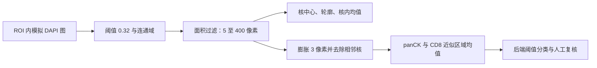

# 02 医学概念与算法边界

[返回手册](../PROJECT_GUIDE.md) · [上一章：项目架构](01-项目架构与数据模型.md)

OncoMosaic 是多标记组织图像定量分析的工程原型。随仓库提供的数据由程序生成；`mock-unmix-v1` 使用固定规则，不包含训练好的医学模型。本章将真实医学概念与代码中的模拟含义分开说明，避免把工程验收误写为临床有效性验证。

## 从成像到标记：先分清两个维度

**高光谱描述采集方式，多重标记描述检测目标。** 高光谱成像在较多窄波段上记录光谱信息，形成“高度 × 宽度 × 波段”的数据立方体；多重免疫组化/免疫荧光通过多个标记观察同一组织中的表达和空间分布。波段数量不等于抗体数量，一张三通道预览也不等于原始三波段数据。[NASA 成像光谱说明](https://ntrs.nasa.gov/search.jsp?R=19860065536)、[SITC 染色与验证共识](https://pubmed.ncbi.nlm.nih.gov/32414858/)

项目沿用“演示高光谱”命名，样例实际是 `256×256×16` 的合成立方体，波长元数据为 420–720 nm，像素边长为 0.5 µm。生成器先画出三组核状/核周图案，再复制到对应波段并加少量噪声。16 个波段不足以单独证明某扫描仪的高光谱性能，`.npz` 也只是本项目输入契约。

模拟解混按波段**索引**分组：`[0:6]`、`[6:11]`、`[11:16]` 分别取均值，裁剪到 0–1，命名为 DAPI、panCK、CD8。代码没有利用波长数值、染料参考光谱或组织自发荧光进行物理解混；不能将其描述为真实光谱识别算法。[数据生成器](../../scripts/generate_demo_hsi.py)、[模型实现](../../inference/app/model.py)

## 开发者术语表

| 术语 | 真实含义 | 本项目中的含义与边界 |
|---|---|---|
| DAPI | 常用核复染染料，优先结合双链 DNA，呈蓝色荧光。[官方说明](https://assets.thermofisher.com/TFS-Assets/LSG/manuals/mp01306.pdf) | 第一组波段的模拟图，用于寻找核状连通区域，不代表真实染色。 |
| panCK | 泛细胞角蛋白抗体用于显示多种角蛋白，常帮助判断上皮来源；正常上皮也表达角蛋白。[AE1/AE3 官方资料](https://tools.thermofisher.com/content/sfs/manuals/180132_Rev0808_man.pdf) | panCK 阳性不能直接等同肿瘤；标记为肿瘤候选区域时，也只能称“候选肿瘤相关细胞”。 |
| CD8 | 免疫表型标记，部分 T 细胞及部分 NK 细胞可表达。[BD CD8 官方资料](https://www.bdbiosciences.com/content/bdb/paths/generate-tds-document.us.340584.pdf) | CD8 信号不能单独确定 T 细胞身份，更不能证明细胞具有杀伤功能。 |
| ROI | Region of Interest，分析时指定的感兴趣区域；空间分析需说明取样区域和分析策略。[SITC 图像分析共识](https://pubmed.ncbi.nlm.nih.gov/39779210/) | 当前只支持原图坐标中的矩形；区域标签由用户给定，不是算法诊断。 |
| 阳性 / 表型 | 按信号与判定规则划分类别；阈值和分割是需要说明的分析环节。[SITC 图像分析说明](https://pmc.ncbi.nlm.nih.gov/articles/PMC11749220/) | `panck`、`cd8`、`double-positive` 是规则标签，不是已验证的生物学身份。 |

## 核检测为什么不等于完整细胞分割

核与完整细胞是不同的测量对象；DAPI 主要帮助显示细胞核，无法单凭该信号确定所有细胞膜边界。[DAPI 使用说明](https://assets.thermofisher.com/TFS-Assets/LSG/manuals/mp01306.pdf)

本项目首先在模拟 DAPI 图上执行 `强度 ≥ 0.32`，对连通区域编号，只保留面积在 **5–400 像素**之间的对象。随后提取核中心、轮廓与核内 DAPI 均值。panCK/CD8 则在核掩膜向外膨胀 3 像素后的区域取均值，并剔除其他已检测核的像素。这块区域包含本核和周围像素，是近似测量区，并非独立识别出的细胞膜。

因此 `Cells` 表中一行更准确地对应“一个检测核及其附近信号”。相邻核粘连可能成为一个连通域；两对象的核周测量区也可能重叠。`double-positive` 仅表示同一对象附近两个模拟均值都达到阈值，不能据此宣称发现了真实共表达细胞。[模型代码](../../inference/app/model.py)、[SPEC 算法契约](../../SPEC.md)



## 阈值、密度与距离应怎样解释

以下是仓库的统计定义，并非通用临床判读标准，依据 [Quantification.cs](../../backend/OncoMosaic.Api/Quantification.cs)。

阳性条件为 `均值 ≥ 对应阈值`。例如某对象 panCK 为 0.60、CD8 为 0.45，在两个阈值都为 0.50 时属于 `panck`；将 CD8 阈值改为 0.40 后属于 `double-positive`。改变的是规则判断，不是原始测量。在同一个 run 的复核结果中，人工标签优先于自动标签。当前界面调整阈值并重新分析会创建新的 run，旧 run 的复核不会自动继承到新 run。

统计先选取核中心在 ROI 内的对象，再去掉最终标签为 `excluded` 的对象。有效对象是阳性比例的分母；双阳性同时计入 panCK 和 CD8，所以两个阳性数可以相加超过有效对象数。

```text
ROI 面积(mm²) = 宽(px) × 高(px) × [像素边长(µm) / 1000]²
阳性比例 = 阳性对象数 / 有效对象数
阳性密度(cells/mm²) = 阳性对象数 / ROI 面积(mm²)
最近距离(µm) = min √[(xCD8−xpanCK)² + (yCD8−ypanCK)²] × 像素边长
```

例如 200×100 px、0.5 µm/px 的 ROI 面积为 0.005 mm²；若有 20 个 panCK 阳性对象，密度为 4,000 cells/mm²。该分母是整个矩形面积，**没有扣除空白、坏死或其他无组织部分**；改变 ROI 取样会影响结果。

距离从每个 CD8 阳性核中心出发，寻找本 ROI 内最近的 panCK 阳性核中心，再汇总平均值。它不是细胞膜间距，也没有搜索 ROI 外对象。双阳性对象同时属于两组，当前实现允许与自身匹配，因此距离可能为 0；某组为空时平均距离为 `null`，不能解释成两组重合。有效对象为空时阳性比例同样为 `null`。

## 质量标志和医学结论的边界

`crop-edge` 表示核连通区域触及 ROI 裁剪边缘，提示对象可能不完整；`ok` 只表示没有触发这条规则，不代表医学质量合格。质量标志本身不会自动剔除统计，只有复核为 `excluded` 才排除；被排除对象仍保留在总数和排除数中。面积过滤掉的连通域则不会进入对象清单。[检测实现](../../inference/app/model.py)、[统计实现](../../backend/OncoMosaic.Api/Quantification.cs)

升级到真实科研分析需要验证染色、图像分析和结果报告，并记录数据、参数及评估方法。SITC 专门对这些环节提出标准化要求；本项目合成夹具上的流程测试不能替代它们。[SITC 染色验证共识](https://pubmed.ncbi.nlm.nih.gov/32414858/)、[STORMI 报告规范](https://pubmed.ncbi.nlm.nih.gov/41423269/)

作为后续工程方案，可以先建立带染色说明、像素标定和人工参考标注的小型评估集，再分别评估核检测、标记判定与区域统计。每次替换算法都保留输入、模型版本、阈值和复核记录，比较同一对象在哪个环节发生差异；不要只看最终总数是否接近。以上是建议的实施路线，当前仓库尚未完成这类真实数据验证。

面试时可表述为：“我实现了从多波段输入、核对象测量到规则分类、人工复核和版本化导出的工程闭环。当前算法是确定性的模拟适配器，没有患者数据、训练集或医学金标准，因此我报告系统行为和测试结果，不报告临床准确率，也不把单标记阳性包装成诊断。”

[下一章：核心功能与截图演示](03-核心功能与截图演示.md)
