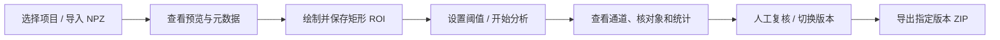
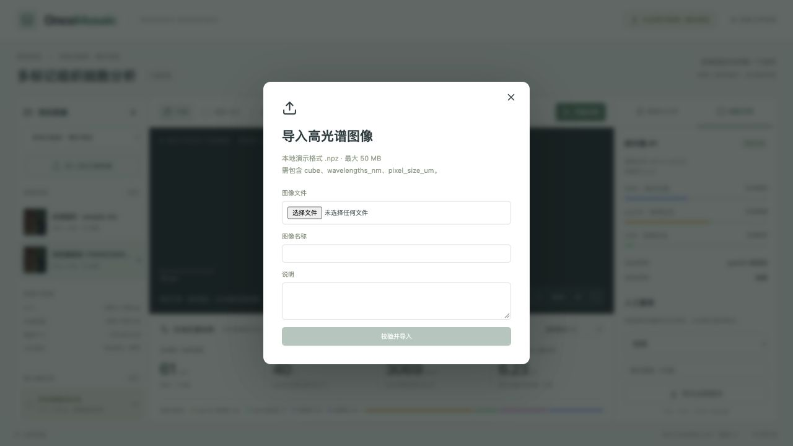
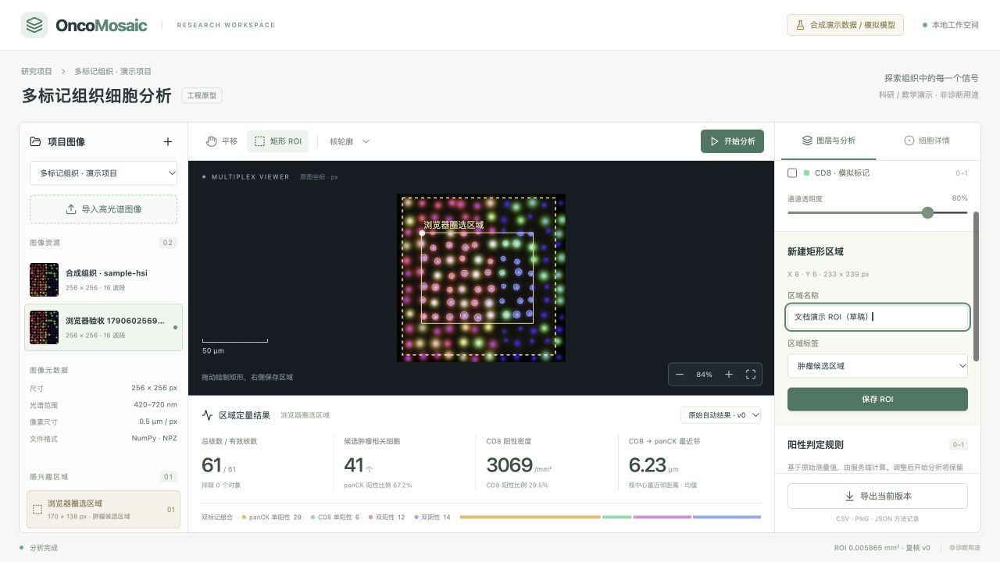
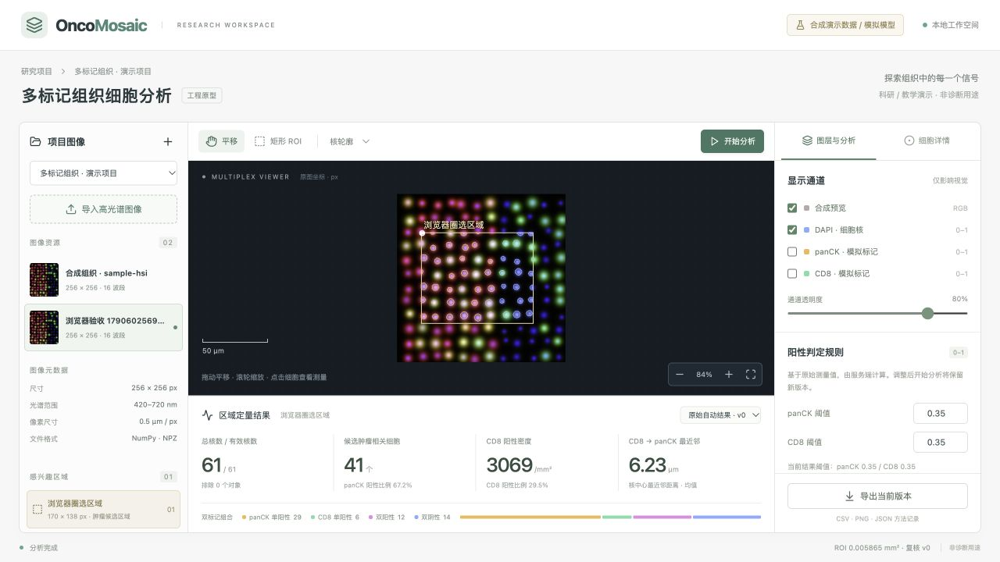
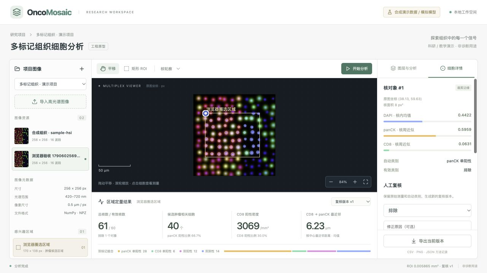
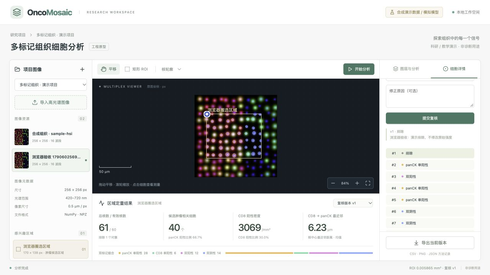
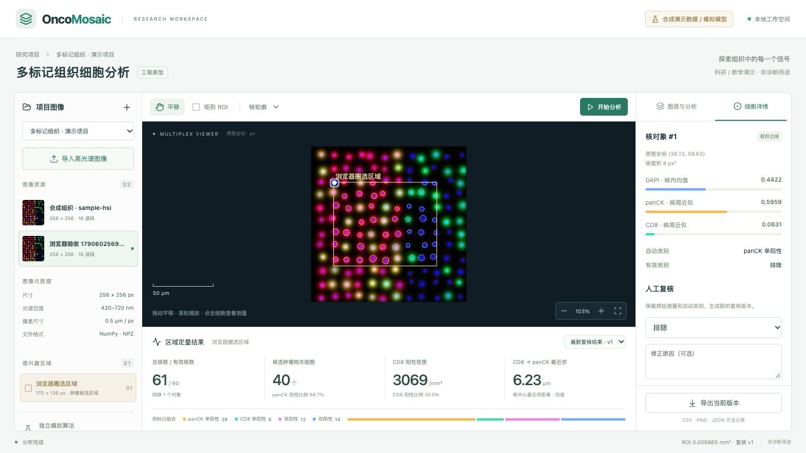

# 03 核心功能与截图演示

[返回手册](../PROJECT_GUIDE.md) · [上一章：医学概念](02-医学概念与算法边界.md)

本章按实际操作顺序讲解。截图来自运行中的本地项目；显示的内容均为合成演示数据。右侧内容较长时可在侧栏内滚动，底部导出按钮保持可见。



## 1. 创建项目与导入图像（F01）

点击左上角“＋”可以创建项目；默认演示项目已有一张 `256×256×16` 样例。点击“导入高光谱图像”，选择 NPZ 并填写名称和可选说明。



**看什么：** 文件限制 50 MB，文件内部要求 `cube`、`wavelengths_nm`、`pixel_size_um`。导入成功后，左侧出现新图像，元数据显示尺寸、光谱范围和像素大小。坏文件会显示错误，不会留下可分析的图像记录。

**演示讲解：** “文件先在后端暂存，再由 Python 检查数组。这里展示的是文件中的真实元数据，而不是前端写死的配置。”

## 2. 缩放、平移并绘制 ROI（F02）

使用滚轮或“＋/－”缩放，选择“平移”拖动视图；“适应窗口”恢复整体视野。选择“矩形 ROI”后，在原图上拖动形成矩形，填写区域名称与“肿瘤候选区域/其他区域”标签，再点击“保存 ROI”。



**图注：** 外围虚线是本次文档演示草稿，坐标约为 `(8,6,233,239)`；内部已有框和底部 61 个核的结果属于之前保存的“浏览器圈选区域”。草稿没有保存和分析，不能把底部指标当成这个草稿的结果。该截图专门展示“绘制”状态。

**看什么：** 保存的是原图像素坐标，与当前缩放百分比无关。区域名称出现在左侧列表；刷新后，已保存的 ROI 仍落在相同图像位置。未保存草稿不会持久化。

**演示讲解：** “浏览器负责把屏幕坐标变回原图坐标，API 再做一次边界检查。图像、区域和细胞都使用同一个坐标系。”

## 3. 设置规则并提交分析（F03）

选择一个已保存 ROI。在“图层与分析”页签设置 panCK/CD8 的 0–1 阈值，点击“开始分析”。

| 界面状态 | 含义 | 用户动作 |
|---|---|---|
| 排队中 | 任务记录已写入数据库，等待 worker | 等待领取 |
| 正在分析 | worker 已领取，正在调用 Python、验证或保存结果 | 等待；可刷新后恢复查看 |
| 分析完成 | 结果已通过校验并提交数据库 | 查看对象、统计、复核或导出 |
| 分析失败 | 保存了错误原因，没有可用成功结果 | 排查 Python/存储后点击“重试分析” |

正常演示任务较快，不一定能肉眼看清每一个过渡状态。分析历史下拉框可以回看旧 run，任务详情显示执行次数。

改变阈值后需要再次“开始分析”，产生新 run；仅修改输入框不会偷偷改变旧任务的统计。目前会重新调用模拟服务，不是已实现的测量缓存重分类功能。

## 4. 查看通道、核对象和区域统计（F04–F05）

分析成功后可开关 DAPI、panCK、CD8，调节透明度，切换轮廓/中心点。合成预览覆盖整张图，结果标记图只覆盖所选 ROI。



**看什么：** 显示设置只改变视觉，不改变原始测量值。底部显示总核数/有效核数、panCK 阳性候选数、CD8 阳性密度、最近邻均值，以及四种双标记组合计数。

本截图系列使用 `170×138 px` 的 ROI、`0.5 µm/px`：v0 有 61 个有效核，panCK 阳性 41 个，CD8 阳性 18 个。最近邻显示均值，缺少任一阳性组时显示“无可计算对象”。

**演示讲解：** “DAPI 是核内平均值，panCK 和 CD8 是核周近似平均值。亮度调节只是显示行为，统计由后端读取保存的浮点测量值计算。”

## 5. 点选细胞并提交人工复核（F06）

点击图上的核轮廓或中心点，右侧出现对象详情。核对象 #1 的例子显示中心约 `(38.13,59.63)`、面积 `8 px²`，且标记为“裁剪边缘”。它的自动类别为 panCK 单阳性，复核后有效类别为“排除”。



选择修正类别、填写可选原因、点击“提交复核”。右侧可查看该细胞的复核历史；底部的版本选择器可切回 v0 或指定历史版本。



**看什么：** 下表对比的是同一个 ROI、同一个 run 的两个版本。

| 指标 | v0 原始自动结果 | v1 排除 #1 后 |
|---|---:|---:|
| 总核数 | 61 | 61 |
| 有效核数 | 61 | 60 |
| 排除核数 | 0 | 1 |
| panCK 阳性数 | 41 | 40 |
| panCK 阳性比例 | 67.2% | 66.7% |
| CD8 阳性数 | 18 | 18 |
| CD8 阳性比例 | 29.5% | 30.0% |
| CD8 阳性密度 | 约 3069/mm² | 约 3069/mm² |

CD8 数量没变，比例却上升，因为有效核数从 61 变成 60；密度不变，因为 ROI 面积和 CD8 阳性数都未改变。这是讲解“不同指标有不同分母”的好例子。

## 6. 导出指定版本（F07）

先选定分析记录和复核版本，再点击右下角“导出当前版本”。下载得到 ZIP，文件含义如下：

| 文件 | 内容 | 讲解重点 |
|---|---|---|
| `cells.csv` | 全部检测核、原始强度、自动/有效类别、质量标记、复核版本 | 被排除对象仍在表中，可追溯 |
| `roi-summary.csv` | 数量、比例、密度、面积、距离 | 与页面同一版本一致 |
| `overlay.png` | 原图加 ROI 边框和核类别叠加 | 排除对象用灰色叉号；元数据包含任务/版本 |
| `method.json` | 原图 SHA-256、ROI、模型/算法、阈值、复核记录、生成时间 | 记录结果是如何产生的 |



导出的 PNG 是服务端按版本重绘的图，不是浏览器截图；它不会记录浏览器当时的缩放、通道透明度和面板布局。重复导出旧版本会重新生成时间，但结果口径保持相同。

## 7. 失败重试如何演示

在本地演示环境中，可按以下顺序操作；先确保没有其他重要分析在运行。

```bash
docker compose stop inference
# 网页新建分析，等待 Failed，查看错误原因
docker compose start inference
# 等待服务恢复，点击该失败任务的“重试分析”
```

实际验收中，同一 run 第一次失败，恢复后 attempt=2 成功，返回 69 个核且 localIndex 不重复。证据见 [API 验收数据](../api-verification.json)。这是故障测试记录；本章没有伪造“运行中”或“失败”的截图。

## 8. 现场演示检查点

1. 开始前确认四个服务正常，打开样例和已保存 ROI。
2. 讲明输入是合成数据，算法是确定性模拟。
3. 操作顺序保持“区域 → 分析 → 点选 → 复核 → 历史版本 → 导出”。
4. 切版本时指出自动类别未被覆盖，比例和密度口径不同。
5. 结束时打开 ZIP 中的 `method.json`，对应页面的任务与版本。

[下一章：实现原理与流程图](04-实现原理与流程图.md)
