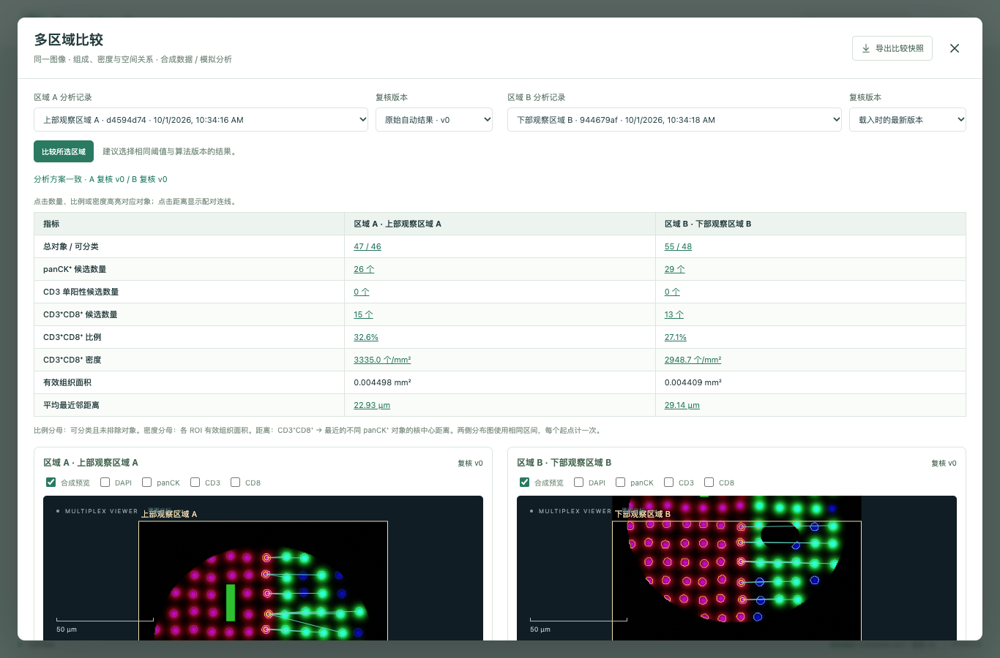
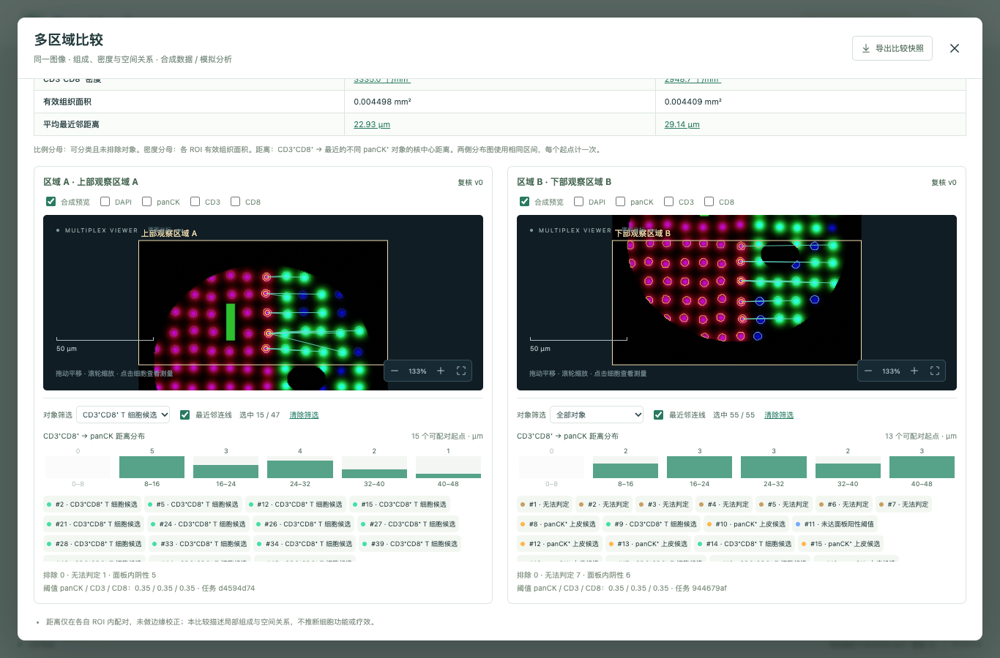
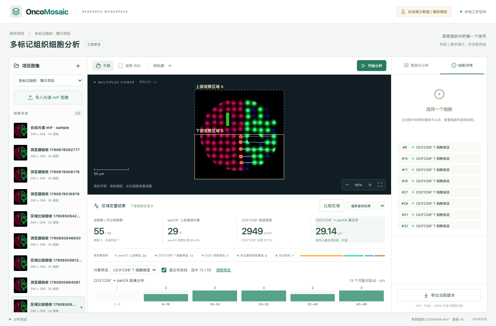

# 03 理想产品流程与当前操作演示

[返回手册](../PROJECT_GUIDE.md) · [上一章](02-医学概念与算法边界.md) · [下一章](04-实现原理与流程图.md)

本章先说明理想平台的用户流程与页面职责，后半部分保留当前原型的实际操作。目标功能不代表截图中已经具备。首次运行方法见 [README](../../README.md)。

带着[研究故事](00-项目背景与研究故事.md)中的问题操作：先看见同一对象的多项信号，再统计 CD3⁺CD8⁺ 候选对象的密度，以及它们与上皮候选对象的空间距离。不要一进入页面就只看汇总数字；先选一个对象核查，它会帮助你理解整份报告。

## 理想平台：从研究项目到报告

### 用户流程与交付物

| 阶段 | 用户要完成的事 | 平台应提供什么 | 进入下一步的依据 |
|---|---|---|---|
| 建立项目 | 定义研究问题、面板和比较范围 | 项目资料、角色、分析方案版本 | 对象与统计口径清楚 |
| 导入资料 | 导入图像并关联样本、切片和批次 | 格式检查、元数据核对、实验资料关联 | 输入完整且处于支持范围 |
| 初步质控 | 判断图像和区域是否适合分析 | 质量图层、异常定位、排除与说明 | 可分析范围明确 |
| 定义分析 | 选择 ROI、目标表型和配置 | 方案预览、参数说明、版本记录 | 用户理解本次分析范围 |
| 执行任务 | 提交单个或批量分析 | 状态、阶段进度、失败原因和重试入口 | 完整结果已发布 |
| 检查结果 | 核查区域、对象、测量和分类 | 通道叠加、对象列表、筛选和联动定位 | 问题对象得到识别 |
| 人工修订 | 修正类别、区域或对象几何 | 修改记录、受影响统计重算和版本比较 | 指定结果版本得到确认 |
| 汇总导出 | 形成报告或比较研究组 | 对象表、区域表、方法、质控和结果快照 | 数字可定位、可解释、可追溯 |

### 工作台应怎样组织

**项目页**呈现样本与切片关系、导入状态、批次和已完成任务，支持筛选缺失资料或需要复核的样本。批量操作应说明选中范围，避免误用不同面板的分析方案。

**图像工作台**以图像为中心，提供通道、组织区域、对象边界、表型及质控图层。点击统计或表格中的对象，应定位到图像；点击图像对象，应展示测量和判定信息。

**分析配置页**让用户知道选择的模型支持哪些数据、输出哪些对象、怎样定义测量与统计。参数应有业务解释，必要时提供预览；不把神经网络内部参数作为普通用户必须理解的操作。

**复核页**优先展示质量问题和不确定对象。修改前后需要能比较，边界变化应提示会重新测量，不能让修改只是视觉变化。多人协作时显示当前版本和冲突。

**报告页**展示结论所需的图、表、单位和分母，并附输入、方案、模型及复核版本。缺失或不可计算的指标应明确说明原因。

### 三个常见异常流程

1. **输入不完整。** 指出缺少波长、像素尺寸或实验关联等哪项资料，保留已有上传，允许补齐后再检查。
2. **分析失败。** 区分输入问题、计算资源问题和服务错误；可重试的任务保留原身份与历史尝试，不创建重复对象。
3. **结果需复核。** 不确定对象可继续显示，但汇总说明其纳入规则。用户完成修订后形成新版本，旧报告仍保持原样。

### 目标功能怎样验收

一个用户应能从报告中的计数追到对象集合，再追到图像位置；修改对象或区域后，受影响的统计应随新版本更新。不同版本之间能解释差异，导出的同一快照应与页面一致。这些交互要求可以先于具体模型实现进行验证。

---

## 当前原型的实际操作

以下步骤对应现有页面。建议先用默认合成样例走完“分析→复核→导出”，再准备符合当前契约的研究输入。

### 第一次使用的观察任务

先找一个标为 `cd3-cd8` 的对象，分别查看 CD3、CD8 信号和对象测量值，确认两项阳性判断针对同一个对象。再找一个 `panck` 对象，理解它为何属于另一类候选。最后看两类计数、有效组织面积和最近邻距离怎样组成汇总。样例输出以本次任务为准，不要求与教学案例数字相同。

## 1. 导入：确认你看到的是什么图像

启动 Compose 后选择默认“合成光谱 mIF”视野，或同时上传 `.ome.tiff` 与 `.assay.json`。不要上传 `.truth.ome.tiff` 作为主图，也不需要把 `controls/` 的全部文件一起上传。

导入后查看宽高、光谱范围、像素尺寸、面板与校准标识。样例为 256×256、24 波段、0.5 µm/px。预览颜色来自多项信号的合成显示，不是普通照片的自然颜色。

导入通过说明文件满足当前格式检查，不说明染色或医学分析已经合格。若文件不匹配，先检查主图哈希、波段数和像素尺寸，不要随意修改哈希或单位只为绕过错误。

## 2. 圈选 ROI：你决定此次分析的范围

在图上画矩形。ROI 坐标和对象坐标都基于原始局部视野；区域标签由人给定。

`tumor-candidate` 这样的标签表示人工选择的用途，不是算法识别出的肿瘤区域。当前模型不会根据这个名称改变组织分区或对象分类。

选择范围会影响结果：空白比例改变有效面积，截断核可能进入无法判定，ROI 外的对象不参与最近邻计算。因此比较不同区域时，必须保留 ROI 和选择规则。

## 3. 设置阈值并运行

设置 panCK、CD3、CD8 阈值，创建分析任务。阈值位于当前相对强度的 0–1 范围内，不是概率，也不是实际蛋白浓度。默认演示阈值没有真实组织的医学依据。

任务完成后再查看本次结果。改变阈值并再次运行会建立新任务；此前的人工复核不会自动迁移到新任务。这样可以保留每次分析的版本，但也意味着比较结果时要先核对 run 和参数。

## 4. 先看对象与质控，再读汇总

切换 DAPI、panCK、CD3、CD8 标记图和核轮廓。点击对象查看原图中心坐标、核面积、四项测量和质量标志。

建议选几个代表性对象，顺着下列问题理解结果：

1. 轮廓圈的是核，还是把两个相邻核连成了一个？
2. 核附近的三项信号来自本对象，还是可能来自邻居？
3. 标签与当前阈值是否一致？是否属于冲突信号或裁剪边缘？
4. “查看质控 JSON”中的有效组织面积和饱和像素是否值得进一步核查？

显示开关改变可见图层，不改变测量值。`ok` 只表示未触发当前裁剪边缘规则；没有表示所有质量问题都已排除。

汇总中的总核数、可分类数和无法判定数应一起读。比例以可分类对象为分母；密度以有效组织面积为分母；最近邻距离是不同候选对象的核中心距离。这些指标的业务含义见[医学章节](02-医学概念与算法边界.md)。

界面中的 `cd3` 类别是 CD3 单阳性，`cd3-cd8` 是双阳性；二者互斥。若要描述全部 T 细胞候选，需同时考虑这两个集合。`negative` 表示三项抗体标记均未达阈值，不表示健康或没有细胞。区域名也不能代替病理确认。

## 5. 复核：比较自动结果与人工版本

对某个已有对象修改类别或设为排除，保存后形成新的复核版本。切换 v0 与后续版本，观察计数、比例或距离怎样变化。

例如把一个 panCK 候选对象设为排除，panCK 数量和可分类数量都会下降，有效组织面积不会同步减少。如果它曾是某个候选 T 对象的最近邻，距离还可能变大。

当前不能通过复核补入漏检对象、拆分粘连核或修正组织掩膜。因此复核完成不意味着分割错误已经全部修复。

## 6. 导出：理解每个文件的用途

| 文件 | 建议先看什么 |
|---|---|
| `cells.csv` | 对象坐标、测量值、自动与有效类别，确认复核影响 |
| `roi-summary.csv` | 计数、面积、比例、密度和距离，核对分母及单位 |
| `overlay.png` | 用于观察对象位置；不能独立重建定量过程 |
| `method.json` | 图像/assay 校验值、ROI、阈值、模型/统计版本、复核版本 |
| `qc.json` | 保留像素、排除像素、饱和像素、平均光谱残差和局限 |

导出时确认选中正确的任务和复核版本。ZIP 不含所有原始输入与浮点图，长期复算仍需另存原图、assay 及对应程序版本。

## 7. 多区域比较与对象联动探索

### 先把研究问题落到两个区域

选择同一张图像上的两个观察区域，问“这两处的上皮和 T 细胞候选组成有什么不同？CD3⁺CD8⁺ 候选对象的密度和到上皮候选对象的距离有什么不同？”每个区域独立算面积与配对，再并排阅读。区域名称是观察用途，不会自动确认肿瘤或间质。

**建议用合成样例的上半部与下半部练习。** 样例的上皮信号偏左，T 细胞信号偏右；如果只圈左右两块，其中一块可能没有某类对象，最近邻就无法计算。这是有效结果，不需要强行填零。

### 实际操作

1. 圈选并保存两个不同 ROI，采用相同 panCK/CD3/CD8 阈值分别完成分析。
2. 点击下方结果区的 **比较区域**。只有当前图像至少两个不同 ROI 有成功任务时按钮才可用。
3. 选择 A/B 的分析记录及复核版本，点击 **比较所选区域**。v0 是自动结果；“载入时的最新版本”会解析为具体版本，并展示在结果上方。
4. 先看数量，再看比例、密度与距离。点击指标可筛选该类对象；有效组织面积没有对象筛选，因为它来自组织像素。
5. 向下滚动查看两侧图像和距离分布。点击有计数的柱形，高亮这个区间的 CD3⁺CD8⁺ 起点，并显示到最近 panCK⁺ 目标的连线。起点和目标仍用各自类别颜色，其他对象变淡；连线目标保持可见，但不计入“选中起点数”。
6. 点击对象列表或核轮廓，图像会定位其核中心；详情显示原始强度、有效类别及最近目标编号。点击目标编号可定位该目标。“对象筛选”可查看无法判定、人工排除、类别已改变或有质量标志的对象；“清除筛选”恢复全部。
7. 需要调整类别时，关闭比较，回到单区域 **细胞详情** 提交复核。重新载入比较才会使用新版本；也可继续选择 v0 回看原始结果。
8. 点击 **导出比较快照**，保存两侧完整对象表、汇总、最近邻配对及方法记录。筛选只影响当前展示，导出不会只剩筛选出的对象。

### 怎样从一个数字找到证据

“平均距离 20 µm”只是一组距离的平均值。先看距离分布：是多数对象集中在 20 µm 附近，还是一半很近、一半很远？再点一个区间，观察连线是否跨过空白、起点或目标是否处于裁剪边缘，最后在通道图上核查候选标签。**连线表示核中心的几何配对，不表示细胞接触、相互作用或杀伤。**

两侧分布图采用相同距离区间，每个可配对起点只计一次；柱顶是对象数，柱高在每侧单独缩放。区间左端包含、右端不包含，最后区间包含上界。没有配对时明确显示“距离不可计算”。

单区域结果也支持相同探索：点击数量/密度卡片、类别名称或距离柱形，查看高亮对象、右侧匹配列表及最近邻目标。通道显示和对象筛选不会重算总数、比例或密度。

### 比较前检查什么

| 界面提示 | 应怎样理解 |
|---|---|
| 分析方案一致 | 两侧模型版本、统计版本及三项阈值相同；不代表已经通过医学验证 |
| 分析方案不一致 | 数值差异可能来自方案变化，建议同方案重跑；不能直接解释为区域差异 |
| ROI 重叠 | 可能重复包含同一组织，不能直接合并计数或作为独立样本 |
| 距离不可计算 | 缺少起点或目标；不是两类对象距离为零 |
| A/B 复核版本 | 当前载入和导出的确切版本；后续复核不会悄悄替换它们 |

当前比较限于同一图像的两个不同 ROI。它描述局部组成与空间关系，尚未提供跨病例研究组比较、显著性检验、批量任务或边缘校正。一个病例的多个区域也不能自然当成多个独立病例。

### 比较导出包

| 文件 | 内容 |
|---|---|
| `cells-A.csv` / `cells-B.csv` | 两侧全部对象、坐标、强度、自动/有效类别和复核版本 |
| `comparison-summary.csv` | 两行区域结果，包含分母、单位对应的指标与配对数 |
| `nearest-neighbors.csv` | 每个起点的来源/目标 ID、编号、核中心坐标和 µm 距离 |
| `method.json` | 图像/assay 哈希、两侧任务、ROI、阈值、模型/统计/复核版本、修改记录和解释提醒 |

不可计算距离在 CSV 中为空，在 JSON 中为 `null`。本包不含原图和全部浮点图，长期复算仍需保留原始输入与对应代码。单区域导出仍使用上一节的五文件格式。

## 8. 当前页面截图

截图来自合成数据上的自动化浏览器流程，只说明界面与服务协作。每次重跑可能创建不同 ROI 和复核记录，不要将截图计数当作固定医学基准。对应工程记录见 [API 验收结果](../api-verification.json)。
