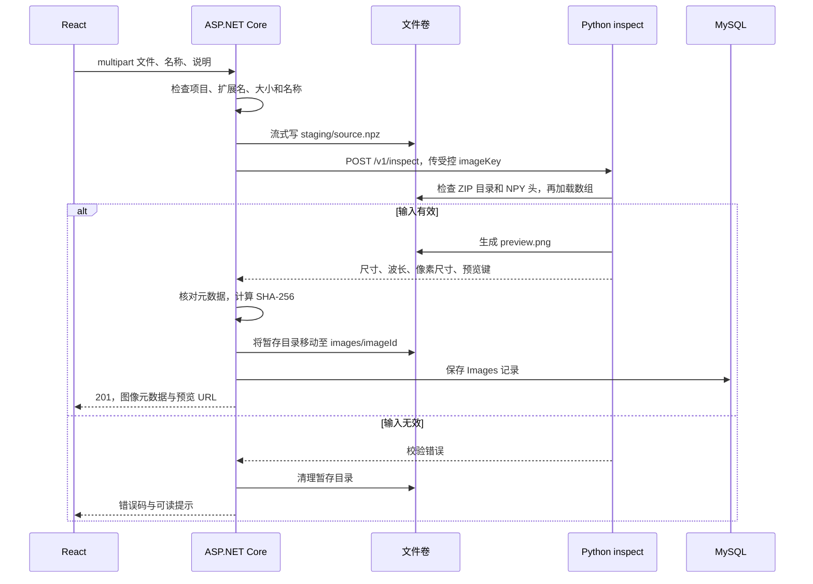
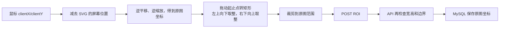
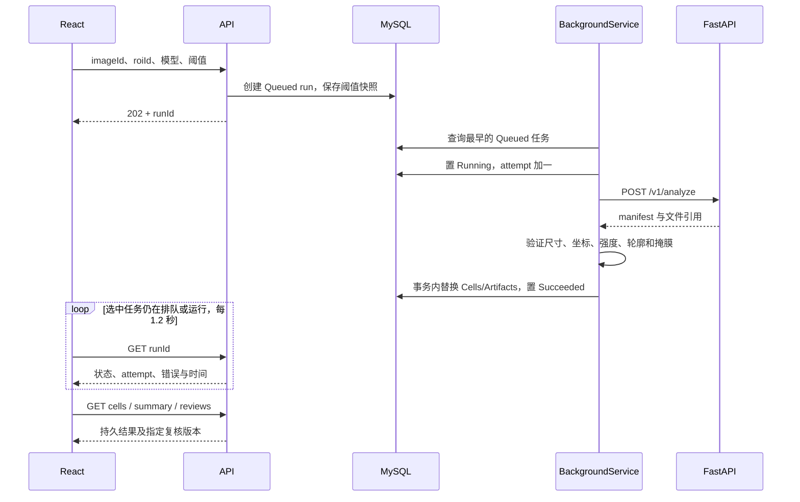
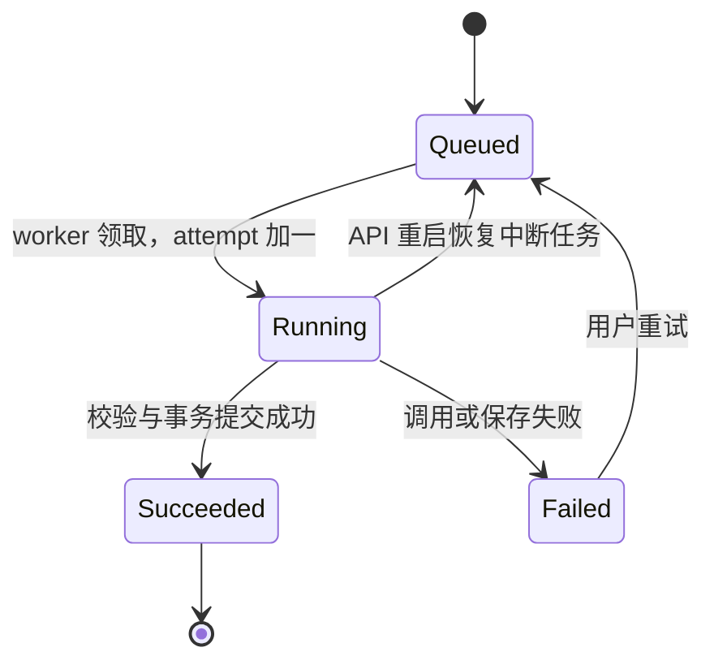
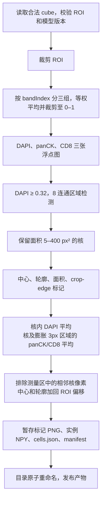
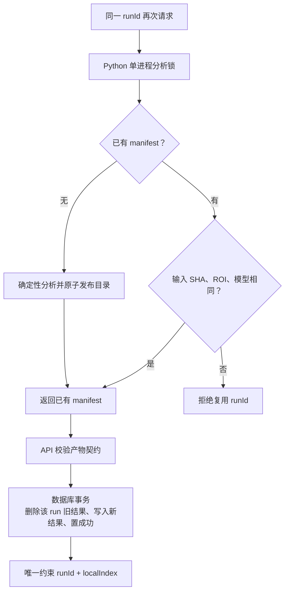
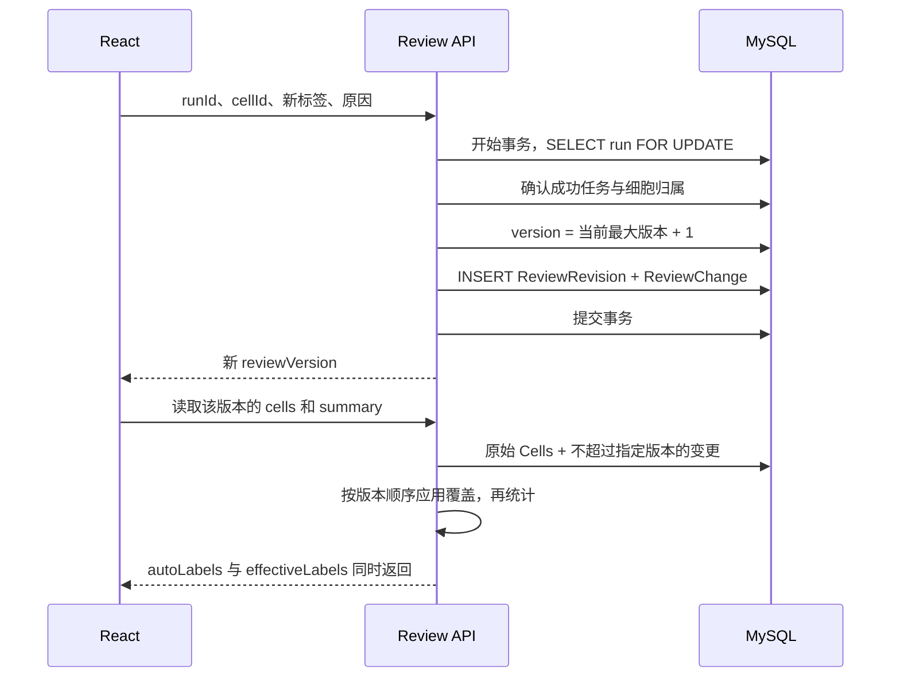
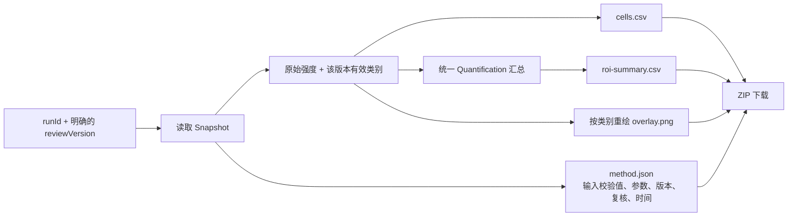

# 04 实现原理与流程图

[返回手册](../PROJECT_GUIDE.md) · [上一章：功能与截图](03-核心功能与截图演示.md)

本章按“输入、处理、保存、输出”说明已经实现的逻辑。流程图对应代码路径，不代表额外实现了消息队列、分布式事务或真实深度学习推理。

## 1. 图像导入：先验证，再发布

入口：`POST /api/projects/{id}/images`。实现位于 [Program.cs](../../backend/OncoMosaic.Api/Program.cs)、[ImportService.Import](../../backend/OncoMosaic.Api/Storage.cs) 和 [load_image](../../inference/app/model.py)。



先检查 ZIP/NPY 头，是为了在分配大数组之前拒绝错误形状、对象类型和超出限制的声明。加载阶段关闭 pickle；加载后再检查 NaN/Infinity、波长严格递增、像素尺寸为有限正数。

文件和数据库是两个资源：普通异常会清理暂存或已移动的目录；进程突然退出的通用补偿/清理没有完全实现，不能把该设计描述成跨资源原子事务。

## 2. ROI：在一个坐标系内工作

来源：[geometry.ts](../../frontend/src/geometry.ts) 与 [Viewer.tsx](../../frontend/src/Viewer.tsx)。

查看器使用 SVG `<g>` 承载图像、ROI 和细胞，统一执行 `translate(tx,ty) scale(s)`。

```text
屏幕局部坐标 xs = 原图坐标 x × s + tx
屏幕局部坐标 ys = 原图坐标 y × s + ty

原图坐标 x = (xs - tx) / s
原图坐标 y = (ys - ty) / s
```

例如缩放为 2 倍、平移 `(100,50)`，鼠标点在查看器局部 `(140,110)`，转换后的原图点就是 `(20,30)`。这里的局部鼠标坐标还要先减去 SVG 元素相对于浏览器窗口的左上角偏移。



Python 在 ROI 局部图上检测后，会把 `roi.x/roi.y` 加回中心与轮廓；标记 PNG 本身仍是 ROI 尺寸，前端将它放在原图的 ROI 起点。因此三个坐标来源最终一致。

## 3. 分析任务：立即响应，后台执行

入口：`POST /api/analysis-runs`；实现：[AnalysisWorker.cs](../../backend/OncoMosaic.Api/AnalysisWorker.cs)。



HTTP 创建任务和 Python 处理分离，因此浏览器不需要一直持有一个长分析请求。队列是数据库里的 `Queued` 记录，worker 每次只处理一个任务；没有引入 RabbitMQ、Kafka 或 Redis 队列。



Python HTTP 客户端超时为 90 秒。失败后记录原因，不向用户返回旧成功结果；重试接口使用 `WHERE status = Failed` 的条件更新，避免重复点击把正在运行的任务重新入队。

## 4. Python 模拟算法：从数组到原始测量

实现：[MockSpectralAdapter](../../inference/app/model.py)。请求/响应 schema 见 [main.py](../../inference/app/main.py)。



波段分组公式为 `floor(bandIndex × 3 / B)`，从 0 开始编号。16 波段对应 `[0:6]`、`[6:11]`、`[11:16]`。波长用于校验与记录，当前并没有按照真实染料谱进行拟合。

DAPI 的 `0.32` 是**检测阈值**；用户设置的 panCK/CD8 `0.35` 等值是**分类阈值**。两者不是同一参数，分类阈值不会传给 Python 去控制核检测。

原始测量保留浮点数；用于显示的 PNG 是 `0–1 → 0–255` 的线性映射，存在量化损失，不参与后端统计。panCK/CD8 的测量区包含本核及周围膨胀区域，并不是一个只取外环的纯膜测量。

## 5. 结果为什么不会因重试重复入库



Python 的 `Lock` 是本进程内互斥；它不是跨主机锁。API 事务防止“只保存一半细胞却显示成功”；数据库唯一约束提供最后一道去重约束。这是单实例下的幂等重放设计，不应称为分布式 exactly-once。

验证清单还包括 `MaskContract.Validate`：读取 NPY 头，确认 int32、C 顺序、尺寸及长度；遍历实例编号，检查每个对象的掩膜像素数与 `areaPx` 相符。见 [MaskContract.cs](../../backend/OncoMosaic.Api/MaskContract.cs)。

## 6. 区域统计的统一口径

来源：[Quantification.Calculate](../../backend/OncoMosaic.Api/Quantification.cs)。

```text
panCK 阳性：panckValue ≥ 当前 run 的 panckThreshold
CD8 阳性：cd8Value ≥ 当前 run 的 cd8Threshold
有效对象：中心在 ROI 内，且 effectiveLabels ≠ excluded

ROI 面积 mm² = width × height × (pixelSizeUm / 1000)²
标记阳性比例 = 该标记阳性有效核数 / 有效核数
标记阳性密度 = 该标记阳性有效核数 / ROI 面积 mm²

单个 CD8 核的最近邻距离 µm
= min(到所有 panCK 阳性核中心的欧氏像素距离) × pixelSizeUm
```

无有效对象时，阳性比例为 `null`。ROI 合法且没有阳性对象时，密度可以是 0。CD8 或 panCK 组为空时，距离为 `null`，不能用 0 代表缺失。

双阳性核同时属于两个集合，当前最近邻定义允许其匹配自身，距离可为 0。这种 0 是公式允许的结果，与“没有对象”的 `null` 不同。

示例：`180×160 px`、`0.5 µm/px` 对应面积 `0.0072 mm²`；20 个 CD8 阳性核的密度为约 `2777.78/mm²`。对应验收实例见 [api-verification.json](../api-verification.json)。

## 7. 人工复核：追加变更，不改原始值



读取 v2 时会应用 v1、v2 中的变更；同一细胞多次修改，以最后一次生效。读取 v0 时不应用复核。版本号属于一个 run，不同 run 的 v1 没有全局先后关系。

数据库锁串行化同一 run 的版本分配，唯一索引进一步约束版本不重复。该设计接近“原始测量 + 追加式修正记录”，但没有实现完整事件溯源系统的事件总线、投影重建基础设施或用户身份审计。

## 8. 导出：先固定版本，再生成四种文件

来源：[ResultService.Snapshot / Export](../../backend/OncoMosaic.Api/Results.cs)。



页面导出时使用当前已显示摘要的具体 `reviewVersion`，而不是让服务器在下载过程中再次追逐一个可能变化的“最新版本”。导出 PNG 基于原图和有效类别重绘，不复制浏览器当前显示图层。

当前快照是业务层的数据组合，不是跨文件/数据库的全局快照事务。单次导出使用同一个组合结果生成各文件，避免四个文件各自重新取“最新值”。

## 9. 前端如何避免异步旧响应覆盖当前图像

[App.tsx](../../frontend/src/App.tsx) 在切换图像或结果时增加请求代次计数，响应返回后比较代次，过期响应不更新状态；effect 清理还会停止旧轮询。选中任务处于排队/运行时每 1.2 秒查询，进入成功或失败后停止。

当前处理是忽略过期响应，并非对所有网络请求实施 AbortController 取消。图像选择保存在 localStorage；ROI、任务及结果从数据库恢复。通道可见性、草稿、缩放和侧栏页签等显示偏好不保证跨刷新持久化。

[下一章：技术要点与工程取舍](05-技术要点与工程取舍.md)
