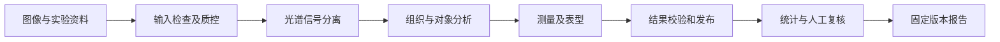
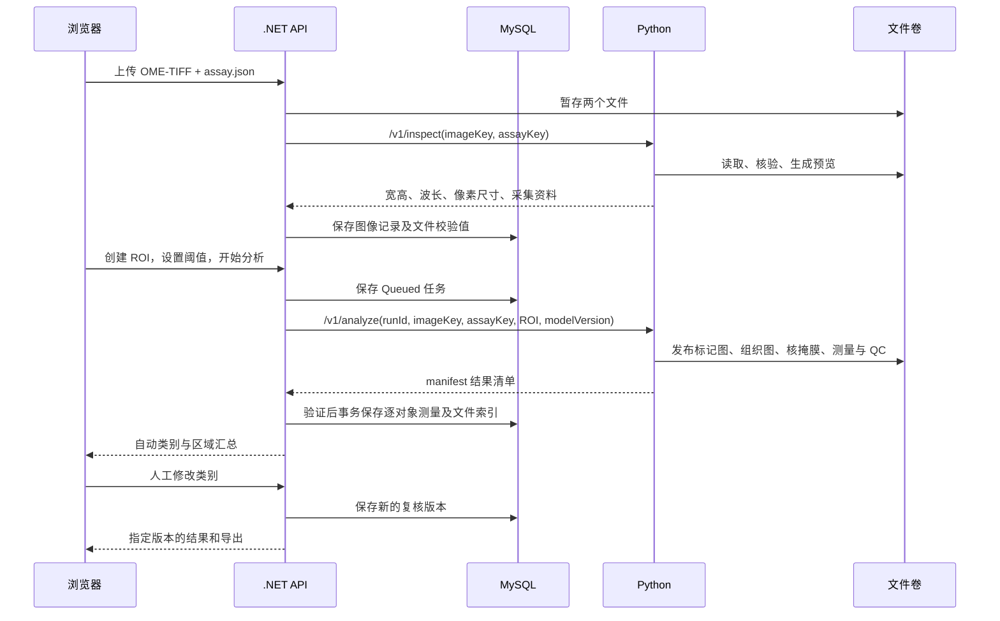

# 04 输入、算法、输出：沿着一次分析理解实现

[返回手册](../PROJECT_GUIDE.md) · [上一章](03-核心功能与截图演示.md) · [下一章](05-技术要点与工程取舍.md)

本章回答“调用 Python 时给什么、拿回什么、每一步由谁负责”。医学名词和结果解释见[第 02 章](02-医学概念与算法边界.md)。这里描述的是当前实现，示例中的路径和对象值仅用于说明结构。

若你还不熟悉接口，先把全过程看成四次信息转换：**像素光谱 → 各标记信号图 → 对象测量表 → 区域报告**。光谱记录光，信号图区分来源，对象表把信号关联到同一个核锚定对象，报告再汇总组成与空间关系。业务动机见[第 00 章](00-项目背景与研究故事.md)。

| 计算环节 | 在回答什么 | 单靠这一环节还得不到什么 |
|---|---|---|
| 光谱解混 | 这个像素中各荧光来源贡献多少？ | 细胞身份与完整边界 |
| 对象检测与分割 | 每个核/细胞对象在哪里，范围是什么？ | 多标记联合表型 |
| 逐对象测量与分类 | 属于这个对象的信号有多少，满足哪些条件？ | 区域密度与空间分布 |
| 区域及空间统计 | 定义的对象集合有多少、多密、多近？ | 临床效果或细胞功能的直接结论 |

`mask` 是用像素记录区域或对象归属的掩膜；`manifest` 是输出文件的清单；`assay` 伴随文件则保存这张图的染色、采集和参考光谱说明。读接口时，先记住它们的用途即可。

## 理想流程：如何把算法能力接入平台

下面描述目标设计；后面的编号章节保留当前服务的具体行为，便于实际运行与对接。

### 一次分析的逻辑步骤



每一步都应明确输入、产物与失败条件。步骤不要求各自部署为一个服务，也不要求全部由深度学习完成。关键是能识别失败发生在哪一层，并让后续步骤只使用完整且适用的结果。

### 接口应该约定哪些语义

| 接口内容 | 需要明确的约定 |
|---|---|
| 图像 | 格式、轴含义、波段顺序、坐标系、物理单位、存储引用和输入身份 |
| 实验信息 | 面板、参考谱、背景、批次和校准版本，以及支持范围 |
| 任务配置 | ROI、目标输出、模型版本、测量区定义和统计方案 |
| 图像结果 | 定量图与显示图的区别，掩膜类别、坐标及像素尺度 |
| 对象结果 | 核或完整细胞的定义、ID、测量、表型及质量状态 |
| 不确定与失败 | 是全任务失败、局部区域排除，还是对象待复核；分别怎样影响统计 |
| 追溯 | 输入身份、模型、配置、代码或运行版本及结果文件清单 |

例如“强度”字段必须同时说明测量区域与尺度；“位置”必须说明是 ROI 坐标、视野坐标还是切片坐标。仅规定 JSON 字段类型，还不足以防止两端对结果含义产生分歧。

### 为什么要设计结果发布阶段

算法完成计算后，业务服务需要确认清单中的文件齐全、对象坐标可定位、区域与测量相符，再将任务标记为成功。理想流程还要处理文件已经写出但数据库登记失败的情况，使重试能够恢复，而不会重复发布。

结果发布完成后才能创建稳定报告。用户在复核过程中看到的草稿与已经确认的报告，应有不同状态和版本标识。

### 模型替换的原则

只要对象含义、坐标和测量语义不变，可以通过模型版本区分不同实现。如果从“核周近似测量”改为“完整细胞膜测量”，即使字段仍是数值，也属于结果含义改变，应升级契约并评估历史比较是否成立。

理想系统还应保存模型适用条件与验证记录。换模型后先在固定参考集上比较中间结果和最终指标，再决定是否用于新的研究分析。

---

## 当前实现详解

## 1. 谁调用谁



浏览器上传真实格式的图像文件，不上传 NumPy 数组。API 和 Python 共享受控文件卷，因此内部 HTTP 请求传文件键，不把几百万个像素展开成 JSON。`imageKey` 是卷内相对路径，不是浏览器任意指定的主机绝对路径。

Python 负责从图像提取可测量对象；.NET 负责持久化任务、阈值分类、人工版本及汇总。**panCK/CD3/CD8 的用户分类阈值不在当前 Python analyze 请求中**；DAPI 检测阈值等参数则是当前 Python 版本内的固定规则。

## 2. 输入文件：像素和实验解释必须同时存在

### 2.1 主图要求

| 项目 | 当前接受范围 | 原因及限制 |
|---|---|---|
| 文件名 | `.ome.tiff` 后缀 | 不是任意 TIFF；当前也不自动兼容 `.ome.tif` 后缀 |
| 图像结构 | 一个 series，读出轴顺序为 `CYX` | C 为光谱波段，Y/X 为高/宽；不支持多时间点、Z 堆栈或整切片金字塔流程 |
| 尺寸 | 8–64 波段，宽高各不超过 2048 | 面向局部视野 |
| 数据类型 | `uint16` 或 `float32` | 不自动接收 RGB JPEG、uint8 或任意扫描仪私有文件 |
| 大小 | API 主文件上传≤50 MB；解码数组≤256 MB | 压缩文件体积与解码后内存体积不同 |
| 物理尺寸 | OME 中 X/Y 尺寸与 `pixelSizeUm` 数值一致 | 当前按方形像素计算；未实现 OME 单位自动转换 |

准备输入时应使用 µm 表达 X/Y 尺寸。**当前代码比较尺寸数值，但没有完整校验或换算 OME 的单位属性**；因此数值通过检查仍可能存在单位解释错误。不能把导入成功理解为完整 OME 合规验证。

`uint16` 输入必须声明 `signalUnit=scanner-counts-16bit` 和 `detectorMaxCount=65535`，代码除以 65535。`float32` 输入须声明 `calibrated-relative-intensity`，或在合成来源下使用 `simulated-relative-intensity`，并满足 0–1 范围。声明“已校准”不会让系统自动完成实验校准。

### 2.2 assay 伴随文件如何读

完整可用文件见[仓库样例](../../data/sample-spectral-mif.assay.json)。以下按用途解释必需字段，避免只看 JSON 字段名而不知道意义。

| 字段组 | 字段 | 应如何理解 |
|---|---|---|
| 契约与来源 | `schema`、`source` | 当前契约为 `spectral-mif-research-v1`；来源声明为合成或去标识研究数据 |
| 样本层次 | `specimenId`、`slideId`、`fieldId` | 分别标识样本、切片和局部视野；不是三个独立患者 |
| 实验追溯 | `assayId`、`scannerId`、`stainBatchId`、`calibrationId` | 指向实验方案、设备、染色批次和校准资料 |
| 坐标与尺度 | `pixelSizeUm`、`fovOriginPx` | 像素边长；当前视野原点只能为 `[0,0]` |
| 波段说明 | `wavelengthsNm` | 长度 B 的严格递增波长数组，顺序与图像波段对应 |
| 来源模型 | `markers`、`referenceSpectra`、`backgroundSpectrum` | 五个来源固定顺序；参考谱 `[5,B]`，背景 `[B]` |
| 解释和绑定 | `referenceProvenance`、`signalUnit`、`imageSha256` | 谱的来源、输入尺度、与主图的哈希绑定 |

固定来源顺序为 `DAPI, panCK, CD3, CD8, autofluorescence`。最后一项帮助估计背景来源，不是第五种抗体标记。

验证还包括有限值、非负参考谱、波长顺序、参考矩阵秩为 5、条件数不超过 10,000 等。通俗地说，系统尝试拒绝无法稳定区分五种来源的参考谱。但通过这些数学检查，不证明谱来自正确的试剂或设备。

样例还包含激发波长、说明和模拟控制文件的文件名/哈希。这些是额外元数据；当前分析器不会据此重读控制图像验证其内容。

## 3. inspect 与 analyze 的请求

### 3.1 导入检查

`POST /v1/inspect`：

```json
{
  "imageKey": "images/example/sample.ome.tiff",
  "assayKey": "images/example/sample.assay.json"
}
```

文件键仅为示意，实际文件必须已存在于服务文件卷。返回 `width`、`height`、`bandCount`、`wavelengths`、`pixelSizeUm`、`previewKey`、`acquisition`。其中 `acquisition` 包含伴随文件的采集资料；预览图是解混后的伪彩合成显示。

### 3.2 分析一个 ROI

`POST /v1/analyze`：

```json
{
  "imageKey": "images/example/sample.ome.tiff",
  "assayKey": "images/example/sample.assay.json",
  "runId": "0ee703d4-3f82-4f6e-84f7-9a24a690d197",
  "roi": {"x": 20, "y": 30, "width": 180, "height": 160},
  "modelVersion": "spectral-mif-sim-v1"
}
```

ROI 坐标是原图像素坐标，x 向右，y 向下。这里裁取从 `(20,30)` 开始、宽 180、高 160 的范围；不得越界或为空。返回的核中心和轮廓再加上 ROI 偏移，因此始终能定位回原图。输出 PNG/掩膜的数组尺寸是 ROI 尺寸，而不是整幅视野尺寸。

例如某核在裁剪图中的中心为 `(12.5,8.0)`，输出中心就是 `(32.5,38.0)`。换算物理距离时使用坐标差乘像素尺寸，不把像素坐标直接当 µm。

## 4. Python 内部每一步产生什么

### 步骤一：读取并规范强度

图像文件排列为 `[B,H,W]`，代码移轴为 `[H,W,B]`，便于每个像素做光谱计算。uint16 换成浮点并除以 65535；原始图像文件保持不变。

这一步只处理存储尺度。假如两次扫描用了不同曝光时间，除以同一个最大值不会自动使两次强度可比较。

### 步骤二：光谱解混

用 `Y` 表示每像素 B 个观测值，`b` 表示背景谱，`R` 表示 `[5,B]` 参考矩阵。当前实现可概括为：

```text
校正光谱 = max(Y - b, 0)
初步系数 = 校正光谱 × R 的伪逆
五张信号图 = clip(初步系数, 0, 1)
重构光谱 = 五张信号图 × R
像素残差 = 各波段重构误差平方平均值的平方根
```

这是无约束线性最小二乘之后的裁剪，不应写成“训练了光谱神经网络”或“严格求解非负最小二乘”。裁剪到上限还会丢失超范围系数信息。

### 步骤三：有效组织和饱和图

当一个像素超过 70% 的波段强度≥0.995，标为饱和。自发荧光图≥0.065 且未饱和的像素成为组织候选，再删除小于 24 px 的连通区域。

得到的 `valid-tissue.png` 只有“保留/不保留”两类。没有输出肿瘤、间质、坏死等多类组织预测。分析 ROI 没有任何有效组织时会报错。

### 步骤四：检测核实例

在有效组织内，将 DAPI≥0.30 的像素连成区域；二维默认按包含对角接触的连通方式处理，保留面积 5–400 px 的区域。每个保留区域获得一个局部整数编号。

这里没有 watershed 拆分或学习式实例分割。相接核可能合并；一个很大的粘连区域还可能被面积规则整个丢弃。先裁剪再检测也意味着换一个 ROI 可能改变对象边界及是否触及边缘。

### 步骤五：建立近似测量区并保存均值

DAPI 在核内求均值。其他三项在“核向外扩张 3 px、剔除其他标记核、限制在有效组织内”的区域求均值。该区域包含核自身，不能简单称为仅有核外的一圈。相邻核的扩张区仍可能共享核外像素。

在样例 0.5 µm/px 下，3 px 对应 1.5 µm；真实输入如果换了像素尺寸，物理扩张半径随之改变。固定像素规则不是跨设备通用的细胞边界定义。

## 5. 返回清单与文件内容

分析返回 manifest，包含 `runId`、`modelVersion`、`roi`、`width`、`height`、`markers`、各文件键、`validTissuePx`、`cellCount` 和 `identity`。其中 `markers` 是四个 `{name, displayKey}` 条目。清单让 API 知道该读取哪些文件，不包含全部像素。

| 产物 | 内容 | 适合用途 |
|---|---|---|
| `markers/DAPI.png` 等四张图 | ROI 内 8 位标记显示图 | 通道观察；不能恢复完整浮点值 |
| `valid-tissue.png` | 二值有效组织图 | 核查面积分母来自哪里 |
| `nuclei-mask.npy` | int32 实例编号图，0 为背景 | 程序核查核对象与像素对应关系；属于内部输出 |
| `nuclei-overlay.png` | 透明核轮廓叠加图 | 可视化定位 |
| `cells.json` | 每个核的中心、面积、轮廓和浮点测量 | 后端分类、复核、统计 |
| `qc.json` | 像素计数、平均残差、方法与局限 | 查看此次分析的技术指标 |
| `manifest.json` | 文件键与输入身份 | 结果发布、重试和追溯 |

当前 `cells.json` 是一个 JSON 数组。下面展示其中一个**假设对象**的字段结构：

```json
{
  "localIndex": 1,
  "x": 32.5,
  "y": 38.0,
  "areaPx": 35,
  "dapiValue": 0.62,
  "panckValue": 0.05,
  "cd3Value": 0.51,
  "cd8Value": 0.48,
  "qualityFlag": "ok",
  "contour": [[29.0, 38.0], [32.5, 35.0], [36.0, 38.0], [32.5, 41.0]]
}
```

`areaPx` 是核面积，不是完整细胞面积。`localIndex` 只在该任务内定位，后端会使用自身对象 ID。核轮廓是原图像素坐标。当前没有 confidence 字段，因为算法没有提供经过校准的置信度。

`qc.signalUnit` 沿用输入声明，例如 `scanner-counts-16bit`；它描述来源尺度。逐对象字段实际来自归一化和拟合后的相对值，不能按原始 16 位计数解读。此处没有更完整的逐测量单位模型。

## 6. .NET 怎样从测量变成报告

.NET 保存测量后执行互斥分类，自动标签与人工有效标签分开。当前分类规则见[统计实现](../../backend/OncoMosaic.Api/Quantification.cs)，理想功能目标见第 02 章。汇总公式为：

```text
可分类对象 = ROI 内对象，且有效标签不是 excluded / unclassified
有效面积 mm² = validTissuePx × (pixelSizeUm / 1000)²
某类比例 = 某类可分类对象数 / 全部可分类对象数
某类密度 = 某类对象数 / 有效面积
空间指标 = 每个 cd3-cd8 对象到最近不同 panck 对象的核中心距离，再求平均
```

界面调整分类阈值并重新分析，会创建新的 run；当前没有实现只重算旧任务分类的轻量流程，旧任务的人工复核也不自动继承。人工复核改变类别而不改变原始图像和测量值。

ZIP 导出包含 `cells.csv`、`roi-summary.csv`、`overlay.png`、`method.json`、`qc.json`。方法文件保存输入哈希、采集资料、ROI、阈值、模型/统计版本和复核版本。**ZIP 不包含全部原图、核掩膜或完整浮点标记图**；需要复算时还应保留原始输入及对应版本代码。

## 7. 重试、失败和追溯为什么重要

同一 run 的身份绑定图像哈希、assay 哈希、ROI、模型版本及相关实验 ID。如果同一 run 已有清单且身份相同，Python 返回已有结果；身份不同则拒绝复用。结果先写临时目录再发布，避免 API 读到写了一半的文件。

API 还会验证返回文件、尺寸与对象数据，再事务保存。这样的工程检查能减少重复对象和不完整结果，却不能判断一个核在生物学上是否分对了。文件哈希能确认文件一致，不能证明文件内容真实、完整或医学正确。

实现入口：[Python HTTP 模型](../../inference/app/main.py) · [分析器](../../inference/app/model.py) · [分类与统计](../../backend/OncoMosaic.Api/Quantification.cs) · [结果与导出](../../backend/OncoMosaic.Api/Results.cs)
