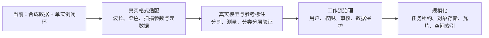

# 05 技术要点与工程取舍

[返回手册](../PROJECT_GUIDE.md) · [上一章：实现原理](04-实现原理与流程图.md)

## 1. 技术点与源码证据

| 技术点 | 本项目中的具体应用 | 为什么重要 | 证据 |
|---|---|---|---|
| 前后端分离 | React 同源访问 nginx `/api` 代理 | 浏览器不依赖 Python 路径和文件系统 | [nginx.conf](../../frontend/nginx.conf) |
| 类型化契约 | TypeScript 类型、C# DTO、Pydantic 请求/响应模型 | 明确字段、坐标、模型和产物约定 | [types.ts](../../frontend/src/types.ts)、[main.py](../../inference/app/main.py) |
| 持久后台任务 | 数据库状态 + BackgroundService | 刷新不丢任务，重启可重放 | [AnalysisWorker.cs](../../backend/OncoMosaic.Api/AnalysisWorker.cs) |
| 幂等结果发布 | 输入指纹、同 run 复用、原子重命名、事务和唯一约束 | 防止重试产生重复或半成品结果 | [model.py](../../inference/app/model.py)、[Domain.cs](../../backend/OncoMosaic.Api/Domain.cs) |
| 原始值与显示分离 | 浮点测量入库，PNG 仅显示 | 亮度开关不会影响统计 | [Quantification.cs](../../backend/OncoMosaic.Api/Quantification.cs) |
| 坐标变换 | 原图坐标持久化，SVG 统一 transform | 缩放、裁剪和叠加能对齐 | [geometry.ts](../../frontend/src/geometry.ts) |
| 追加式人工修正 | ReviewRevision + ReviewChange | 自动结果、旧版本仍可查看 | [Program.cs](../../backend/OncoMosaic.Api/Program.cs) |
| 结果溯源 | 输入 SHA、ROI、规则、模型、复核写入 method.json | 能说明一个结果从何而来 | [Results.cs](../../backend/OncoMosaic.Api/Results.cs) |
| 契约防御 | NPY 头、实例面积、文件键验证 | 不把算法服务响应无条件当成可信结果 | [MaskContract.cs](../../backend/OncoMosaic.Api/MaskContract.cs) |
| 自动化交付 | 锁文件、迁移、Compose、单元/契约/E2E 测试 | 新环境可重复启动与验收 | [verify.yml](../../.github/workflows/verify.yml) |

这里的强类型不是自动生成的全栈统一 schema，TypeScript 与服务端 DTO 仍由代码维护；生成客户端是后续可以减少契约漂移的方向。

## 2. 为什么选择这套组合

**.NET 负责业务，Python 负责图像计算。** 当前实现把规则、状态与数据库操作放在 ASP.NET Core，把数组和图像操作放在 NumPy/scikit-image。收益是职责清楚、适配器可替换；代价是 HTTP 契约、共享存储、部署与失败处理都必须明确。

**MySQL 存结构化数据，卷存大文件。** 细胞强度、坐标、复核适合关系查询，图像数组和 PNG 更适合文件存储。代价是数据库备份和文件备份要一起考虑，单独恢复其中一份可能出现文件缺失或孤立文件。

**SVG 满足当前小图交互。** 原图最多 2048×2048，统一 `<g>` 变换让对齐清晰，原生对象事件便于点选。它没有证明能处理几十万对象的全切片视图；那时应评估 Canvas/WebGL、瓦片和空间索引。

**数据库队列降低首版组件数。** 单用户、单 worker 无需先部署消息中间件。代价是当前领取代码没有分布式租约，多 API 副本会竞争同一条 Queued 记录；不能仅增加副本数就宣称横向扩展成功。

## 3. 三种容易混淆的版本

| 名称 | 当前含义 | 不应混淆为 |
|---|---|---|
| `modelVersion` | Python 模拟算法契约，当前 `mock-unmix-v1` | 模型经过医学验证的证据 |
| `runId` / `thresholdsJson` | 一次分析与其阈值快照 | 一条会不断被新阈值覆写的记录 |
| `reviewVersion` | 同一 run 的人工修正序列，v0 为原始自动结果 | 新的一次模型训练或推理 |

`algorithmVersion` 当前记录为 `quantification-v1`。现有代码尚未实现多个分类算法版本的执行分派；以后改动分类公式时，应保留旧算法实现或固化旧自动类别，不能只改版本字符串便认为历史算法自动可重放。

## 4. 一致性保障的准确边界

| 场景 | 已实现 | 仍需补齐 |
|---|---|---|
| 同一任务失败重试 | 同 runId、attempt 增加、Python 复用、结果唯一约束 | 分布式重复消费控制 |
| API 执行中重启 | Running 恢复 Queued，重新执行 | 租约、心跳、跨实例任务归属 |
| 结果保存中出错 | Cells、Artifacts、成功状态在同一个 MySQL 事务里 | 文件与数据库的跨资源补偿治理 |
| 同一 run 并发复核 | 事务锁任务行，版本唯一索引 | 身份、角色、多人冲突策略 |
| 历史导出 | 固定 reviewVersion，用同一 Snapshot 生成文件 | 长期结果封存、算法升级兼容 |
| 阈值调整 | 创建新 run，不覆写旧规则 | 复用原测量的独立规则重算层 |

文件 SHA-256 用于输入身份与结果追溯；当前文件读取不是每次都重新验证摘要。它不能替代防篡改签名、存储权限和审计系统。

## 5. 性能特点：知道复杂度，不编造压测数字

核检测由 scikit-image 处理；当前 Python 针对每个候选核会构造与 ROI 尺寸相当的布尔掩膜并膨胀，随图像与对象数增大会产生开销。可以评估按区域包围盒处理、批量测量或其他分割后处理方式。

最近邻实现对每个 CD8 阳性核遍历 panCK 阳性核，复杂度约为 `O(N_CD8 × N_panCK)`。首版小样例易于理解和验证；更大数据可以评估 KD-tree，但要保证双阳性自身匹配与空集合规则一致。

后端支持按视野坐标过滤细胞，不过当前在加载该 run 的结果后做内存过滤；前端也会请求整个 run 的细胞。右侧快捷对象列表展示前 300 个，SVG 仍接收全部细胞。这不是已经完成了数据库空间查询、服务器分页或视野分块渲染。

ZIP 当前完全在内存中生成，适用于演示规模。更大图像或更多对象应评估流式 CSV/ZIP、导出任务和对象存储。

没有提供经过控制的吞吐量、并发量、延迟分位数或“提速百分比”，因此不应把功能测试通过当成性能压测结果。

## 6. 已有测试如何支撑论证

| 层级 | 检查内容 | 当前证据 |
|---|---|---|
| Python 22 项 | 确定性、合法波段、错误数组/波长、越界、坏 ZIP、路径、并发重试 | [test_contract.py](../../inference/tests/test_contract.py) |
| .NET 5 项 | ROI 边界、状态、阈值、物理单位、空集合、复核保留自动标签 | [DomainTests.cs](../../backend/OncoMosaic.Tests/DomainTests.cs) |
| 前端 3 项 | 缩放坐标、反向拖动裁剪、正确点选及通道不改测量 | [geometry.test.ts](../../frontend/src/geometry.test.ts)、[Viewer.test.tsx](../../frontend/src/Viewer.test.tsx) |
| API 真实服务 | 上传、分析、历史复核/导出、停 Python 重试、数据库重启 | [verify_e2e.py](../../scripts/verify_e2e.py) |
| 浏览器 | 真正上传、画 ROI、分析、点选、复核、导出、刷新 | [workflow.spec.ts](../../frontend/e2e/workflow.spec.ts) |

测试总数可用于说明工程验证范围，不能当成样本量、临床性能或覆盖率百分比。现有 [CI 运行](https://github.com/sjjjlol/OncoMosaic/actions/runs/36430124804) 已成功；这对应特定代码提交和环境，不表示未来所有变更都自动正确。

## 7. 从原型演进到真实平台

这些是规划，不是已交付功能。真实模型接入时，先明确输出是否仍是核对象、如何测量标记、像素物理尺度如何获得，再决定能否复用现有统计。不能为了适配界面而把区域标签伪装成三张可靠标记图。

[下一章：面试话术与追问](06-面试话术与追问.md)
