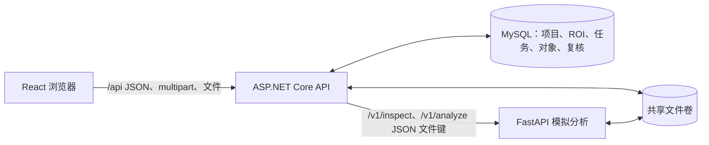
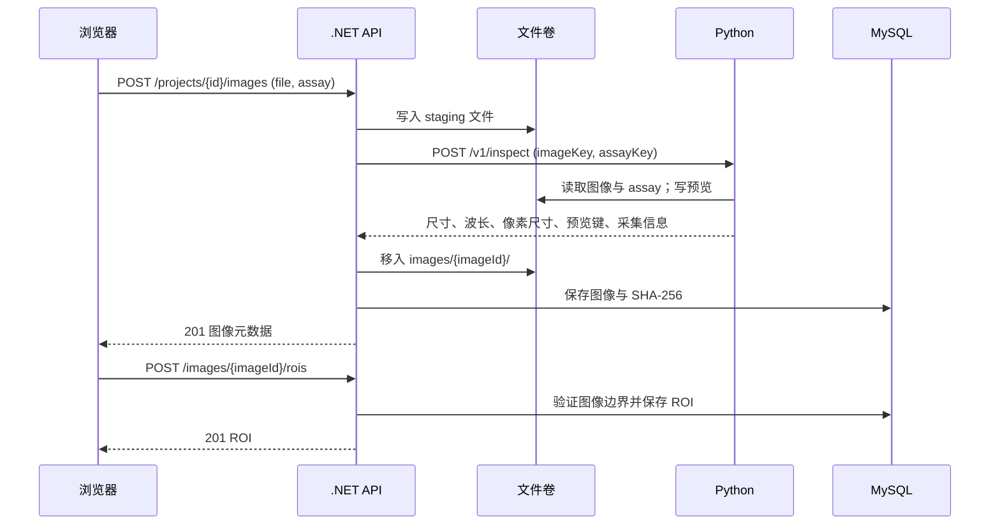
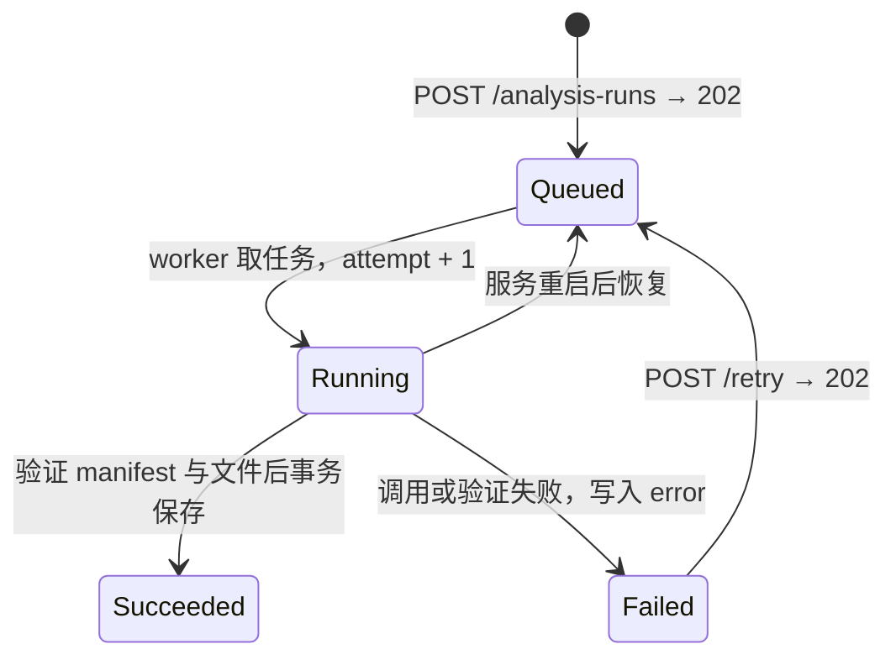
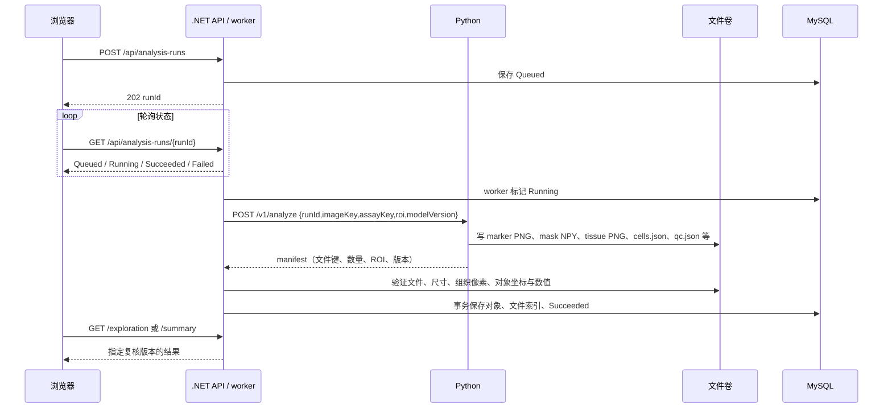
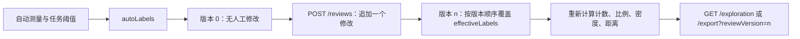
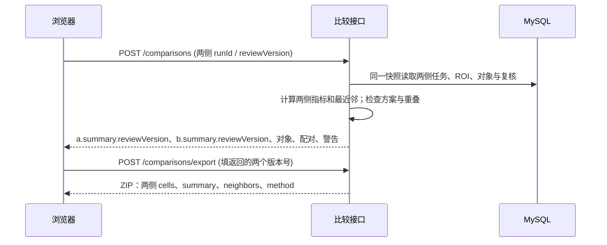

# 关键接口设计与流程

[返回项目手册](PROJECT_GUIDE.md) · [实现原理](guide/04-实现原理与流程图.md) · [完整输入限制](../SPEC.md)

本文是**当前代码的接口说明**，面向前端开发、后端对接和演示。公开入口是 `/api`（浏览器经前端服务转发）；`/v1` 是 .NET 在内部网络调用的 Python 服务。示例 ID 均为占位符。仓库数据和分析器均为确定性模拟，接口成功不代表医学有效性。

## 1. 边界与通用约定



- JSON 字段采用 `camelCase`；ID 为 UUID，时间为服务端序列化的时间戳。创建操作返回 `201 Created`，分析入队和重试返回 `202 Accepted`。文件接口返回 PNG、JSON、NPY 或 ZIP，不按 JSON 解析。
- 错误通常为 `{"code":"INVALID_ROI","message":"…"}`，应先检查 HTTP 状态，再读取 `code`。未就绪结果为 `409 NOT_READY`；不存在的任务或版本分别可能为 `404 NOT_FOUND`、`404 VERSION_NOT_FOUND`。Python 错误由 .NET 转成 `422 INFERENCE_REJECTED`；后台分析失败记录在任务的 `error` 字段。
- 图像和对象位置使用**原图像素坐标**；ROI 为左上角 `(x,y)` 与正的 `width,height`，右、下边界不包含。有效组织面积为 `validTissuePx × (pixelSizeUm / 1000)²`，单位 mm²。
- 当前接口没有认证、分页和客户端幂等键；部署到共享或公网环境前需要补充这些能力。当前只有一个后台 worker，任务状态需轮询。

## 2. 浏览器 API 总览

| 用途 | 方法与路径 | 输入 | 成功响应 |
|---|---|---|---|
| 健康检查 | `GET /api/health` | 无 | `200 {status:"ok"}`；数据库不可用为 503 |
| 项目 | `GET /api/projects`、`POST /api/projects` | 创建：`{name}`，1–120 字 | 项目数组；创建为项目对象 |
| 图像 | `GET /api/projects/{projectId}/images`、`GET /api/images/{imageId}` | 无 | 图像元数据，含 `previewUrl`、尺寸、波段、校验值 |
| 导入 | `POST /api/projects/{projectId}/images` | `multipart/form-data`：`file`、`assay`，可选 `name`、`description` | `201` 图像元数据 |
| 预览 | `GET /api/images/{imageId}/preview` | 无 | `image/png` |
| ROI | `GET /api/images/{imageId}/rois`、`POST /api/images/{imageId}/rois` | 创建：`{name,x,y,width,height,regionTag}` | ROI 数组；创建为 ROI 对象 |
| 分析任务 | `GET /api/images/{imageId}/analysis-runs`、`POST /api/analysis-runs`、`GET /api/analysis-runs/{runId}` | 创建：`{imageId,roiId,modelVersion,thresholds}` | 任务列表；创建/查询为任务对象 |
| 重试 | `POST /api/analysis-runs/{runId}/retry` | 无；仅 `Failed` 可重试 | `202` 同一任务的新 `Queued` 状态 |
| 分析文件 | `GET /api/analysis-runs/{runId}/artifacts/{kind}` | `kind` 见下文 | 对应文件流 |
| 对象与汇总 | `GET /api/analysis-runs/{runId}/cells`、`…/summary` | 可选 `reviewVersion`；对象列表还支持 `x,y,width,height` | 对象数组或汇总对象 |
| 探索 | `GET /api/analysis-runs/{runId}/exploration` | 可选 `reviewVersion` | ROI、汇总、对象、逐对象最近邻、复核记录 |
| 复核 | `GET /api/analysis-runs/{runId}/reviews`、`POST /api/analysis-runs/{runId}/reviews` | 创建：`{cellId,newLabel,reason?}` | 历史数组；创建为 `{reviewVersion}` |
| 单 ROI 导出 | `GET /api/analysis-runs/{runId}/export` | 可选 `reviewVersion` | ZIP 文件 |
| 双 ROI 比较 | `POST /api/images/{imageId}/comparisons` | `{a:{runId,reviewVersion},b:{runId,reviewVersion}}` | 两侧固定版本的探索结果、`sameScheme`、`warnings` |
| 比较导出 | `POST /api/images/{imageId}/comparisons/export` | 同上，建议填已解析版本号 | ZIP 文件 |

`kind` 来自成功任务的文件索引：`DAPI`、`panCK`、`CD3`、`CD8`、`overlay`、`tissue` 为 PNG，`mask` 为 NPY，`cells` 与 `qc` 为 JSON。结果接口仅在任务 `Succeeded` 后可读。`cells` 的视野过滤四个参数必须同时给出，宽高须为正数。

## 3. 导入与 ROI：请求怎样变成可分析的图像



导入的 `file` 必须以 `.ome.tiff` 结尾，最多 50 MiB；`assay` 必须以 `.assay.json` 结尾，最多 100,000 字节。图像解码后还受 CYX、8–64 波段、2048×2048 等校验约束。`name` 省略时取文件名，最长 160 字；`description` 最长 2000 字。Python `/v1/inspect` 只接收卷内相对文件键，不接收浏览器文件内容；它的返回字段为 `width,height,bandCount,wavelengths,pixelSizeUm,previewKey,acquisition`。

创建 ROI 示例：

```json
{"name":"区域 01","x":20,"y":30,"width":100,"height":80,"regionTag":"tumor-candidate"}
```

`regionTag` 仅支持 `tumor-candidate` 或 `other`；名称必填且最多 120 字。ROI 坐标必须落在图像内。上传文件不合规分别可能产生 `400 INVALID_FILE`、`413 FILE_TOO_LARGE`、`422 INFERENCE_REJECTED`；ROI 错误为 `400 INVALID_ROI`。

## 4. 异步分析：任务、内部契约与结果发布



创建请求示例：

```json
{"imageId":"<uuid>","roiId":"<uuid>","modelVersion":"spectral-mif-sim-v1","thresholds":{"panck":0.35,"cd3":0.35,"cd8":0.35}}
```

三个阈值均必填、有限且在 0–1 内；ROI 必须属于该图像。`modelVersion` 当前只接受 `spectral-mif-sim-v1`。返回含 `runId,roiId,status,attempt,modelVersion,algorithmVersion,thresholds,createdAt,startedAt,finishedAt,error`。前端轮询 `GET /analysis-runs/{runId}`，只在 `Succeeded` 后读取结果；`Failed` 时显示 `error.code/message` 并可重试同一 `runId`。重复创建分析会产生新任务。



`/v1/analyze` 不接收用户的 panCK/CD3/CD8 阈值：Python 产生测量，.NET 在读取结果时按任务阈值分类。manifest 含 `runId,modelVersion,roi,width,height,markers,maskKey,overlayKey,tissueKey,qcKey,validTissuePx,cellsKey,cellCount,identity`。`identity` 由 Python 记录输入与参数身份；当前 .NET 反序列化的 `Manifest` **没有读取或核验该字段**。worker 核对任务/ROI/版本、四个标记、文件键归属、图像尺寸、有效组织像素、QC、mask 与逐对象测量后才发布成功状态。

## 5. 结果、人工复核与版本

`GET /cells` 的每个对象包含 `cellId,localIndex,x,y,areaPx,intensities,autoLabels,effectiveLabels,qualityFlag,contour`。强度为 0–1 范围内的模拟测量；DAPI 为核内均值，其他三标记为核周近似区域测量，`contour` 使用原图像素坐标。`summary` 包含 `counts,denominators,areaMm2,units,thresholds,reviewVersion,panckFraction,cd3Cd8Fraction,panckDensity,cd3Cd8Density,meanNearestDistanceUm,nearestDistancesUm,regionTag,notice`。无可分类对象时比例为 `null`；无可配对对象时平均距离为 `null`。



`newLabel` 可为 `negative`、`panck`、`cd3-cd8`、`cd3`、`unclassified`、`excluded`；`reason` 最多 2000 字。每次 POST 追加一个复核版本并返回版本号，只能修改当前成功任务中的既有对象。`reviewVersion` 省略或传 `null` 表示请求时的最新版本，`0` 表示自动结果；不存在的版本返回 `404 VERSION_NOT_FOUND`。复核之后应显式传版本号导出，以保持屏幕数据与文件一致。单 ROI ZIP 含 `cells.csv`、`roi-summary.csv`、`overlay.png`、`method.json`、`qc.json`。

## 6. 双 ROI 比较与导出

```json
{"a":{"runId":"<run-a-uuid>","reviewVersion":0},"b":{"runId":"<run-b-uuid>","reviewVersion":2}}
```

两侧必须来自 URL 指定的**同一图像、不同 ROI**；否则分别返回 `400 COMPARISON_IMAGE_MISMATCH` 或 `400 COMPARISON_SAME_ROI`。比较请求在可重复读事务内解析两侧结果，不创建持久比较记录，也不重跑 Python。返回 `imageId,imageSha256,assaySha256,pixelSizeUm,a,b,sameScheme,warnings`；每侧含 `runId,modelVersion,algorithmVersion,roi,summary,cells,nearestNeighbors,reviews`。模型、统计版本或阈值不同时 `sameScheme=false`；ROI 重叠只生成警告。



如果请求里的 `reviewVersion` 为 `null`，每次调用都取当时最新版本；因此比较页面应把第一次返回的 `a.summary.reviewVersion`、`b.summary.reviewVersion` 填回导出请求，避免期间有人复核导致下载版本变化。比较 ZIP 含 `cells-A.csv`、`cells-B.csv`、`comparison-summary.csv`、`nearest-neighbors.csv`、`method.json`。距离是本 ROI 内 `cd3-cd8` 到不同 `panck` 对象核中心的最近距离，单位 µm；没有配对时无距离值。

## 7. 代码定位与维护

| 契约 | 权威实现 |
|---|---|
| 浏览器路由、状态码和入参校验 | [`Program.cs`](../backend/OncoMosaic.Api/Program.cs) |
| 请求类型、任务与 ROI 字段 | [`Domain.cs`](../backend/OncoMosaic.Api/Domain.cs) |
| 导入与内部 HTTP 客户端 | [`Storage.cs`](../backend/OncoMosaic.Api/Storage.cs) |
| worker 发布与 manifest 校验 | [`AnalysisWorker.cs`](../backend/OncoMosaic.Api/AnalysisWorker.cs) |
| 版本化结果与单 ROI 导出 | [`Results.cs`](../backend/OncoMosaic.Api/Results.cs) |
| 比较验证和导出 | [`Comparison.cs`](../backend/OncoMosaic.Api/Comparison.cs) |
| Python `/v1` 模型 | [`main.py`](../inference/app/main.py) |

更改字段或语义时，应同步核对上述代码、前端 [`types.ts`](../frontend/src/types.ts) 与本文件；医学解释和算法边界见[第 02 章](guide/02-医学概念与算法边界.md)。

## 8. Ki-67 接口扩展

首期已实现，实际请求、响应、错误码与 v2 导出见 [Ki-67 实施说明](Ki67实施说明.md)。上文请求示例和接口表描述四标记兼容行为；以下列出扩展职责，总体目标见 [功能设计](Ki67功能设计.md)：

| 接口环节 | 目标变化 |
|---|---|
| 导入 / inspect | 新版 assay 声明五标记和六来源参考谱，返回可用标记与 Ki-67 能力；旧四标记保留 |
| 创建分析 / Python 测量 | 固定契约、面板、测量、Ki-67 规则、目标对象群和取样版本；Python 测核内值，后端判定状态 |
| manifest / cells | 新增 Ki67 定量图、显示图、核内测量及质量；身份与 Ki-67 自动/有效状态分开 |
| summary / exploration | 按群返回阳性、阴性、无法判定、未检测、可评价数、比例与覆盖率；不可用为 null 并带原因 |
| reviews | 增加修改维度与基础复核版本；未检测不可人工伪造成检测结果，冲突版本拒绝写入 |
| comparisons / export | 专项口径检查、可比时百分点差、固定版本与显式导出契约版本；旧版 ZIP 保持可用 |

不能仅新增 `thresholds.ki67` 就认为功能接入完成，也不能在旧 `newLabel` 中添加互斥 `ki67` 类别。五标记任务使用 `spectral-mif-sim-v2` 与 `thresholds.ki67`；Python 路径仍为 `/v1/analyze`。复核维度是 `identity` 或 `ki67`，v2 必须提供基础版本。
